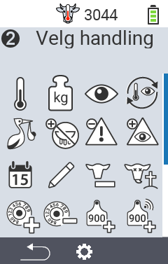
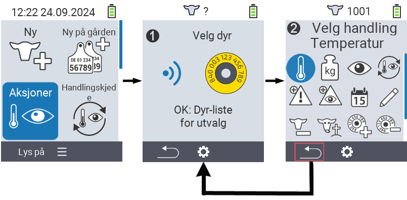
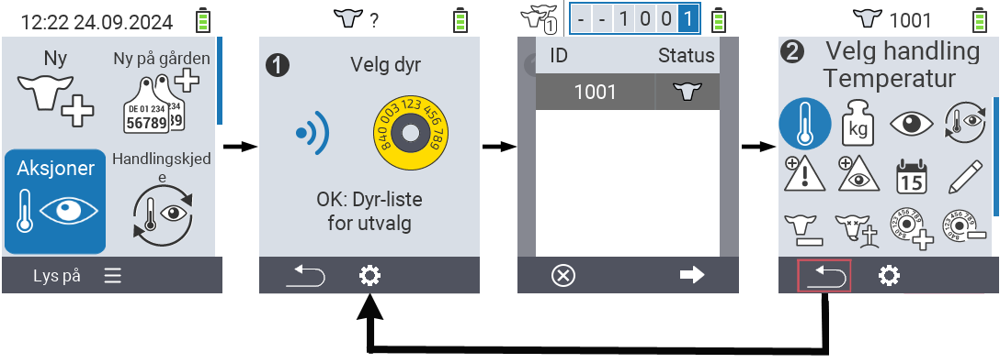

## Tilgjengelige handlinger {#available-actions}

Avhengig av dyretypen kan du utføre opptil 16 forskjellige handlinger for et dyr.

<map name="workmap">
  <area shape="rect" coords="3,100,60,165" alt="Temperatur" title="Mål feber hos dyrene dine&#10;Museklikk: åpne dokumentasjon" href="/no/docs/actions/measure-temperature/">
  <area shape="rect" coords="60,100,118,165" alt="Veiing" title="Registrer vekten til dyrene dine&#10;Museklikk: åpne dokumentasjon" href="/no/docs/actions/record-weight/">
  <area shape="rect" coords="118,100,174,165" alt="Vurdering" title="Vurder dyrene dine&#10;Museklikk: åpne dokumentasjon" href="/no/docs/actions/rating/">
  <area shape="rect" coords="174,100,230,165" alt="Handlingskjede" title="Anvende og sette opp handlingskjede&#10;Museklikk: åpne dokumentasjon" href="/no/docs/chain-of-actions/">
   <area shape="rect" coords="3,165,60,225" alt="Kalving" title="Registrer en kalving&#10;Museklikk: åpne dokumentasjon" href="/no/docs/actions/calving/">
   <area shape="rect" coords="60,165,120,225" alt="Sinlegging" title=" Sinlegg en ku eller legg henne til listen over ferske kyr&#10;Museklikk: åpne dokumentasjon" href="/no/docs/actions/dry-off/">
   <area shape="rect" coords="120,165,175,225" alt="Alarm" title="Legg til og fjern dyr fra alarmlisten&#10;Museklikk: åpne dokumentasjon" href="/no/docs/actions/alarm/">
   <area shape="rect" coords="175,165,230,225" alt="Under observasjon" title="Sett dyr på observasjonslisten eller fjern dem&#10;Museklikk: åpne dokumentasjon" href="/no/docs/actions/on-watch/">
   <area shape="rect" coords="3,225,60,280" alt="Dyrehistorikk" title="Se et dyrs historikk&#10;Museklikk: åpne dokumentasjon" href="/no/docs/actions/animal-history/">
   <area shape="rect" coords="60,225,120,280" alt="Rediger" title="Rediger data for det valgte dyret&#10;Museklikk: åpne dokumentasjon" href="/no/docs/actions/edit/">
   <area shape="rect" coords="120,225,175,280" alt="Avregistrer" title="Avregistrer et dyr&#10;Museklikk: åpne dokumentasjon" href="/no/docs/actions/unregister/">
   <area shape="rect" coords="175,225,230,280" alt="Dyretap" title="Registrer et dyretap&#10;Museklikk: åpne dokumentasjon" href="/no/docs/actions/animal-loss/">
   <area shape="rect" coords="3,280,60,337" alt="Koble transponder" title="Tildel en transponder til et dyr&#10;Museklikk: åpne dokumentasjon" href="/no/docs/actions/link-transponder/">
   <area shape="rect" coords="55,280,120,337" alt="Fjern transponder" title="Fjern transponderkoblingen til et dyr&#10;Museklikk: åpne dokumentasjon" href="/no/docs/actions/unlink-transponder/">
   <area shape="rect" coords="120,280,175,337" alt="Koble dyre-ID manuelt" title="Tildel en nasjonal dyre-ID til et dyr som ikke har en nasjonal dyre-ID&#10;Museklikk: åpne dokumentasjon" href="/no/docs/actions/link-animal-id/#link-animal-id">
   <area shape="rect" coords="175,280,230,337" alt="Koble dyre-ID med skanning" title="Tildel en nasjonal dyre-ID til et dyr som ikke har en nasjonal dyre-ID&#10;Museklikk: åpne dokumentasjon" href="/no/docs/actions/link-animal-id/#link-animal-id-with-electronic-ear-tag-scan">

   <area shape="rect" coords="100,340,140,375" alt="Innstillinger" title="Åpne innstillingene&#10;Museklikk: til dokumentasjonen" href="/no/docs/actions/setting/">
</map>

{}
Hver handling er identifisert med et symbol. Flytt musepekeren over et symbol i grafikken nedenfor og la den hvile et øyeblikk. Et verktøytips vises, som presenterer informasjon om den respektive handlingen. Hvis du klikker på et av symbolene, blir du videresendt til en beskrivelse av den respektive handlingen.
{}

## Generell prosedyre {#general-procedure}

Innenfor menyen   `` kan du velge neste dyr når som helst uten å måtte forlate menyelementet Handlinger. For å velge neste dyr, gjør følgende:

1. Velg menyelementet   `` på hovedskjermen til din VitalControl-enhet og trykk på `` knappen.

2. Enten skann et dyr ved hjelp av transponderen eller velg et dyr fra listen. Bekreft ved å trykke `` og velg et dyr ved hjelp av piltastene △ ▽. Bekreft med ``.

3. En undermeny åpnes der du finner ikoner for en rekke dyrehandlinger. Bruk piltastene til å velge ønsket handling og start handlingen ved å trykke på `` knappen. Avhengig av hvilken handling som er valgt, vil en eller flere skjermer eller et popup-vindu vises.

4. Hvis ønskelig, kan du nå velge og utføre en annen handling for det gjeldende dyret.

5. Etter at du har utført ønsket(e) handling(er) for dyret, gå tilbake til trinn 2 'Dyrevalg'. For å gjøre dette, trykk på den venstre knappen `F1` under ` symbolet i nederste venstre hjørne av foten.

6. Vinduet fra trinn to åpnes igjen automatisk, og du kan velge neste dyr eller gå tilbake til hovedmenyen ved å trykke på `F1` knappen under ` symbolet.



{}

{}
{}

{}


