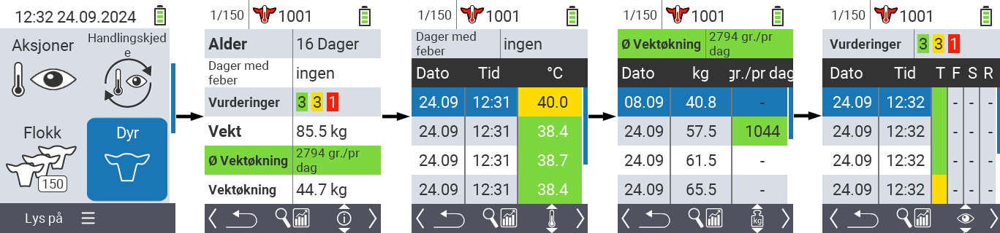
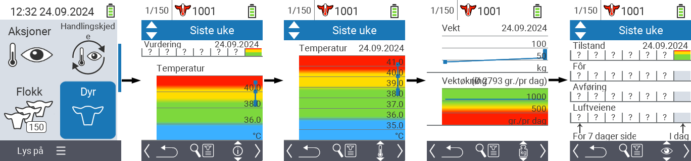
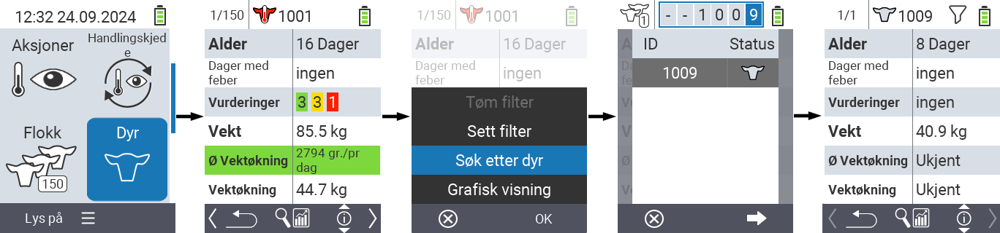
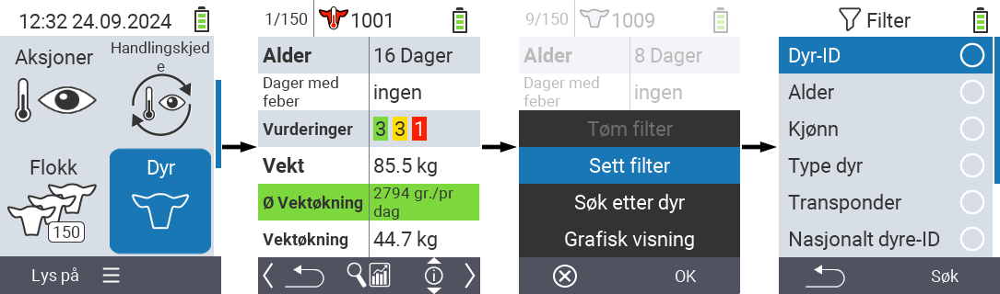

## Dyr {#animal}

Funksjonen for individuelle dyr lar deg se viktig informasjon om vekt, temperatur og vurdering for hvert enkelt dyr. Du har alltid muligheten til å vise informasjonen som en grafikk eller som en liste. For å bruke funksjonen for enkelt dyr, gjør følgende:

1. På hovedskjermen til din VitalControl-enhet, velg menyvalget  `` og trykk på `` knappen.

2. En oversikt over den viktigste dyreinformasjonen åpnes. Øvre kant av skjermen viser hvilket dyr du ser på for øyeblikket. Bruk `F3` tasten for å velge mellom dyreinformasjon , temperatur , vekt  og vurdering .

{}
Innenfor hver informasjonsvisning har du muligheten til å [søke etter et dyr](#search-animal), sette et [filter](#set-filter) og bytte til en [grafisk visning](#set-graphical-view).
Du kan også bytte mellom de enkelte dyrene når som helst ved hjelp av piltastene ◁ ▷.
{}

### Sett grafisk visning {#set-graphical-view}

1. Trykk på den midtre øvre `På/Av` knappen  for å åpne en pop up-meny. I denne menyen kan du velge mellom funksjonene ``, ``, eller ``.

2. Velg `` med piltastene △ ▽ og bekreft med ``.

### Søk dyr {#search-animal}

1. Trykk på den midtre øvre `On/Off` knappen  for å åpne en pop up-meny. I denne menyen kan du velge mellom funksjonene ``, ``, eller ``.

2. Velg `` med piltastene △ ▽ og bekreft med ``.

3. Bruk piltastene △ ▽ ◁ ▷ for å velge ønsket dyrenummer og bekreft med ``

### Sett filter {#set-filter}

1. Trykk på den midtre øvre `On/Off` knappen  for å åpne en pop up-meny. I denne menyen kan du velge mellom funksjonene ``, ``, eller ``.

2. Velg `` med piltastene △ ▽ og bekreft med ``.
Du kan få instruksjoner om hvordan du bruker filteret [her]().

