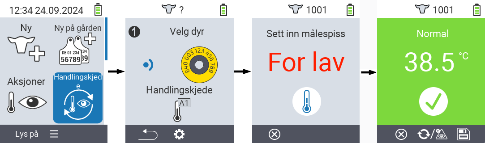
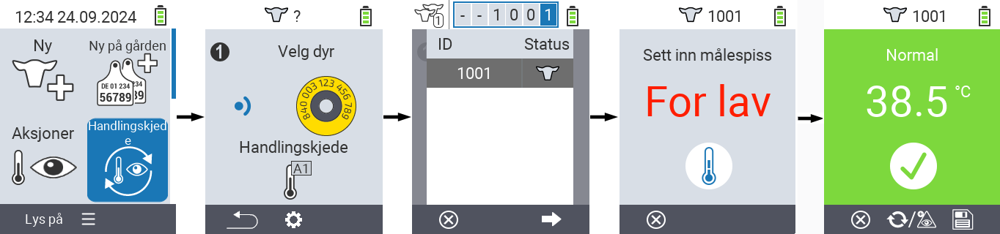

## Kjede av handlinger {#chain-of-actions}

Handlingskjeden lar deg automatisk utføre flere handlinger for et dyr etter hverandre. For eksempel kan du velge handlingene `` og ``. Hvis du deretter utfører handlingskjeden, kan du først ta dyrets temperatur og deretter registrere vurderingen umiddelbart etterpå.

### Bruk kjede av handlinger {#use-chain-of-actions}

1. På hovedskjermen til din VitalControl-enhet, velg menyvalget &nbsp;&nbsp; `` og trykk på ``-knappen.

2. Enten skann et dyr ved hjelp av transponderen eller bekreft med `` og bruk piltastene △ ▽ ◁ ▷ for å angi ønsket dyre-ID.

3. Handlingskjeden utføres nå. Så snart alle handlingene i handlingskjeden er utført, kan neste dyr velges direkte.



{}

{}
{}

{}


### Sett kjede av handlinger {#set-chain-of-actions}

1. På hovedskjermen til din VitalControl-enhet, velg menyvalget &nbsp;&nbsp; `` og trykk på ``-knappen.

2. Bruk knappen `F2` &nbsp;&nbsp; (``).

3. En overleggsskjerm dukker opp. Bruk piltastene △ ▽ for å velge mellom de oppførte handlingene 1 - 4 (du kan utføre opptil fire handlinger på rad). Bruk piltastene ◁ ▷ for å velge ønsket handling for den respektive handlingen. Lagre innstillingene med `F1`-tasten &nbsp;&nbsp;.

4. Hvis du vil tilbakestille hele handlingskjeden, velg alternativet `` i undermenyen ved å bruke piltastene △ ▽ og bekreft med ``.

    

{}
Innenfor de enkelte handlingene har du de samme innstillingsmulighetene som beskrevet i kapittelet [Handlinger](../actions) for hver enkelt handling.
{}

{}
Symbolene på startskjermen til handlingskjeden viser hvilke handlinger du har satt og i hvilken rekkefølge.
{}
