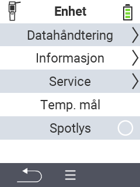

{}
Hvis du klikker på et menyelement, blir du omdirigert til en beskrivelse av den respektive funksjonen.
{}

<map name="workmap">
  <area shape="rect" coords="2,40,238,80" alt="Datahåndtering" title="Kjør datalagring, eksporter dataene dine og tilbakestill enheten&#10;Museklikk: åpne dokumentasjon" href="/no/docs/device/data-management/">
  <area shape="rect" coords="2,80,238,120" alt="Info" title="Vis viktig programvare- og maskinvareinformasjon&#10;Museklikk: åpne dokumentasjon" href="/no/docs/device/info/">
  <area shape="rect" coords="2,120,238,160" alt="Service" title="Sjekk enhetsdriverne dine, oppdater fastvaren og utfør en rekkeviddetest&#10;Museklikk: åpne dokumentasjon" href="/no/docs/device/service/">
  <area shape="rect" coords="2,160,238,200" alt="Temperaturmåling" title="Test enhetens temperaturmåling&#10;Museklikk: åpne dokumentasjon" href="/no/docs/device/temperature-measurement/">
  <area shape="rect" coords="2,200,238,240" alt="Lommelykt" title="Slå lyset på din VitalControl-enhet av eller på&#10;Museklikk: åpne dokumentasjon" href="/no/docs/device/flashlight/">

  <area shape="rect" coords="2,282,97,318" alt="Tilbake" title="Gå tilbake ett nivå" href="/no/docs/menu/mainmenu/">
</map>
