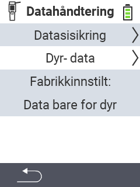

{}
Hvis du klikker på et menyelement, blir du omdirigert til en beskrivelse av den respektive funksjonen.
{}

<map name="workmap">
  <area shape="rect" coords="2,40,238,80" alt="Datakopi" title="Instruksjonene for å lage en sikkerhetskopi finner du her&#10;Museklikk: åpne dokumentasjon" href="/no/docs/device/data-management/data-backup/">

  <area shape="rect" coords="2,80,238,120" alt="Dyredata" title="Instruksjonene for å gjenopprette en sikkerhetskopi finner du her&#10;Museklikk: åpne dokumentasjon" href="/no/docs/device/data-management/animal-data/">

  <area shape="rect" coords="2,120,238,200" alt="Fabrikkinnstilling" title="All informasjon og instruksjoner for å tilbakestille enheten og dyredataene finner du her&#10;Museklikk: åpne dokumentasjon" href="/no/docs/reset/">

  <area shape="rect" coords="2,282,120,319" alt="Tilbake" title="All informasjon og instruksjoner for å eksportere dyredata finner du her&#10;Museklikk: åpne dokumentasjon" href="/no/docs/device/">
</map>
