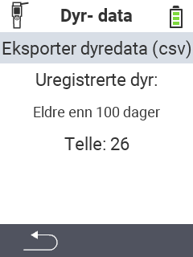

<map name="workmap">
  <area shape="rect" coords="2,40,238,80" alt="Eksporter dyredata (csv)" title="Eksporter dine dyredata&#10;Museklikk: åpne dokumentasjon" href="/no/docs/data-export/usb-drive/">

  <area shape="rect" coords="2,80,238,200" alt="Avregistrer dyr" title="Spesifiser alderen fra hvilken dyr skal avregistreres&#10;Museklikk: åpne dokumentasjon" href="/no/docs/device/data-management/animal-data/unregister-animal/">

  <area shape="rect" coords="2,282,120,319" alt="Tilbake" title="All informasjon og instruksjoner for eksport av dyredata finner du her&#10;Museklikk: åpne dokumentasjon" href="/no/docs/device/data-management/">
</map>
