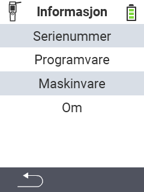

{}
Hvis du klikker på et menyelement, blir du omdirigert til en beskrivelse av den respektive funksjonen.
{}

<map name="workmap">
  <area shape="rect" coords="2,40,238,80" alt="Serienummer" title="For å hente serienummeret til enheten din, klikk her&#10;Mausklick: zur Dokumentation" href="/no/docs/device/info/serial-number/">
  <area shape="rect" coords="2,80,238,120" alt="Programvare" title="Instruksjonene for å vise programvareversjonen din finner du her&#10;Mausklick: zur Dokumentation" href="/no/docs/firmware/versions/">
  <area shape="rect" coords="2,120,238,160" alt="Maskinvare" title="For å få tilgang til maskinvareinformasjonen til enheten din, klikk her&#10;Mausklick: zur Dokumentation" href="/no/docs/device/info/hardware/">
  <area shape="rect" coords="2,160,238,200" alt="Om" title="Hent leverandørinformasjon&#10;Mausklick: zur Dokumentation" href="/no/docs/device/info/about/">

  <area shape="rect" coords="2,282,120,319" alt="Tilbake" title="Hopp tilbake på nivå&#10;Mouse click: open documentation" href="/no/docs/device/">
</map>
