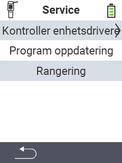

{}
Hvis du klikker på et menyelement, blir du omdirigert til en beskrivelse av den respektive funksjonen.
{}

<map name="workmap">
  <area shape="rect" coords="2,42,238,82" alt="Sjekk enhetsdrivere" title="Instruksjonene for å sjekke enhetsdriverne dine finner du her&#10;Museklikk: åpne dokumentasjon" href="/no/docs/diagnosis/hardware/">
  <area shape="rect" coords="2,82,238,122" alt="Fastvareoppdatering" title="Instruksjonene for å oppdatere fastvaren din finner du her&#10;Museklikk: åpne dokumentasjon" href="/no/docs/firmware/update/">
  <area shape="rect" coords="2,122,238,162" alt="Rekkeviddetest" title="Instruksjonene for å utføre en rekkeviddetest finner du her&#10;Museklikk: åpne dokumentasjon" href="/no/docs/diagnosis/rfid-scan/">

  <area shape="rect" coords="2,282,120,319" alt="Tilbake" title="Hopp tilbake på nivå&#10;Museklikk: åpne dokumentasjon" href="/no/docs/device/">
</map>
