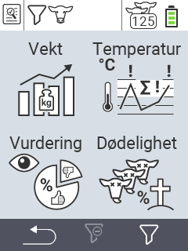

{}
Hvis du klikker på et menyelement, blir du omdirigert til en beskrivelse av den respektive funksjonen.
{}

<map name="workmap">
  <area shape="rect" coords="3,40,116,160" alt="Vekt" title="Evaluer dine lagrede data i Vekt-seksjonen&#10;Museklikk: åpne dokumentasjon" href="/no/docs/evaluation/weight/">
  <area shape="rect" coords="3,160,116,279" alt="Vurdering" title="Evaluer dine lagrede data i vurderingsseksjonen&#10;Museklikk: åpne dokumentasjon" href="/no/docs/evaluation/rating/">

  <area shape="rect" coords="116,40,238,160" alt="Temperatur" title="Evaluer dine lagrede data i Temperatur-seksjonen&#10;Museklikk: åpne dokumentasjon" href="/no/docs/evaluation/temperature/">
  <area shape="rect" coords="116,160,238,279" alt="Dødelighet" title="Evaluer dine lagrede data i dødelighetsseksjonen&#10;Museklikk: åpne dokumentasjon" href="/no/docs/evaluation/mortality/">

  <area shape="rect" coords="150,282,238,319" alt="Filter" title="Sett et filter&#10;Museklikk: til dokumentasjonen" href="/no/docs/filter">
  <area shape="rect" coords="2,282,95,319" alt="Tilbake" title="Hopp tilbake ett nivå&#10;Museklikk: til dokumentasjonen" href="/no/docs/menu/mainmenu/">
</map>
