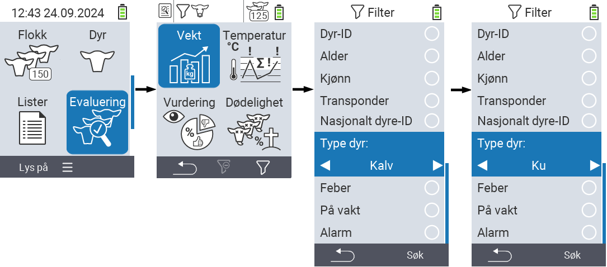
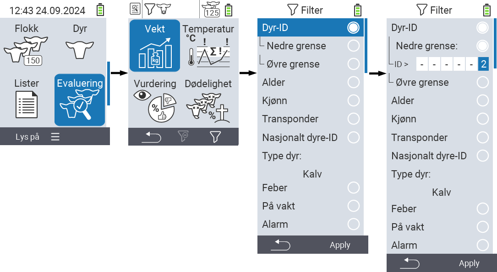
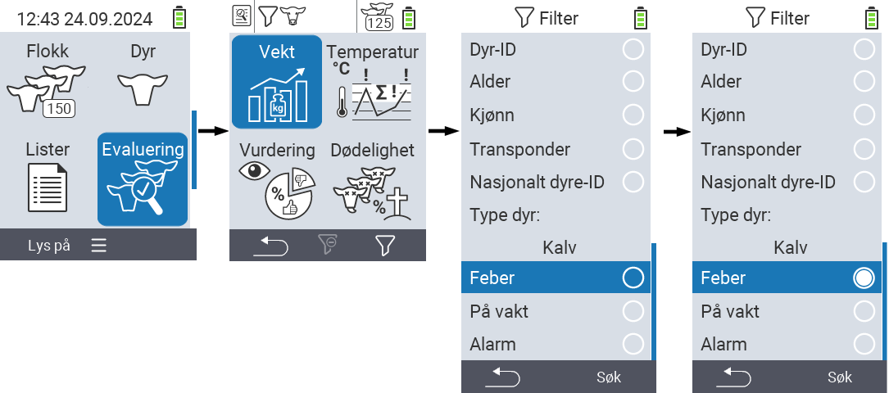

## Anvende filtre {#applying-filters}

{}
Filteret hjelper deg med å utføre et utvalg ved hjelp av filterkriterier innenfor menyvalgene ``, `` og `` på VitalControl-enheten. Så snart du anvender et filter, vises symboler for de ulike filterkriteriene øverst på skjermen. Disse symbolene brukes til å hjelpe deg med å finne ut om og hvilke filterkriterier som er aktivert. For eksempel, hvis du setter `` filteret til hann, vil enheten kun bruke hann-dyr. For eksempel, hvis du også aktiverer `` filteret, vil enheten kun bruke hann-dyr som er på observasjonslisten.
{}

For å opprette et filter i evalueringene, gjør følgende:

1. I undermenyen som tilhører toppmenyelementet  `` trykk på `F3` tasten  en gang. I undermenyen som tilhører toppmenyelementene  `` og  ``, må du trykke på tasten to ganger.

2. En undermeny åpnes der du kan sette alle filteralternativer. Du kan filtrere etter ``, ``, ``, ``, ``, ``, ``, `` og ``.

3. For filtrene ``, ``, `` og `` naviger til det tilsvarende området og bekreft med ``. Bruk piltastene ◁ ▷ for å spesifisere ønsket innstilling. Bruk `F3` tasten `` for å sette den valgte innstillingen på plass. For å forkaste filterendringene dine, trykk på `F1` tasten &nbsp;&nbsp;.

4. For filtrene `` og `` velg det tilsvarende kriteriet og bekreft med ``. Du vil nå bli vist en nedre og øvre grense. Naviger til ønsket grense ved hjelp av piltastene △ ▽ og bekreft ved å trykke `` to ganger. Nå kan du sette ønsket tall ved hjelp av piltastene ◁ ▷ og piltastene △ ▽. Når alle innstillinger er korrekte, trykk `` igjen for å forlate innstillingsmodus og bruke det valgte filteret/filtrene med `F3`-tasten ``. Ved å bruke `F1`-tasten &nbsp;&nbsp;, kan du forkaste endringene dine hvis ønskelig.

5. For filtrene ``, `` og `` er det en mulighet for å deaktivere eller aktivere deres anvendelse. For å gjøre dette, velg det tilsvarende filteret og bekreft med ``. Filteret er nå aktivt. Bekreft igjen med `` for å deaktivere filteret.

6. Når du har satt alle filtrene, bruk `F3`-tasten `` for å sette de definerte filtrene på plass eller trykk `F1`-tasten  for å forkaste endringene dine til filteret/filtrene.
