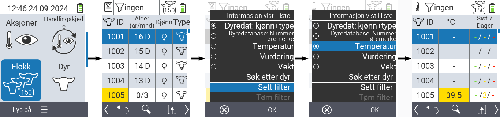
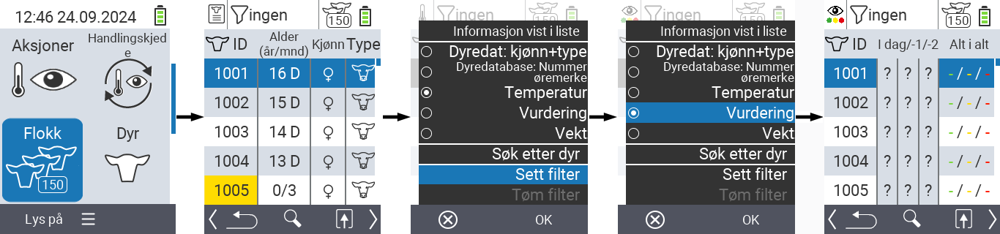
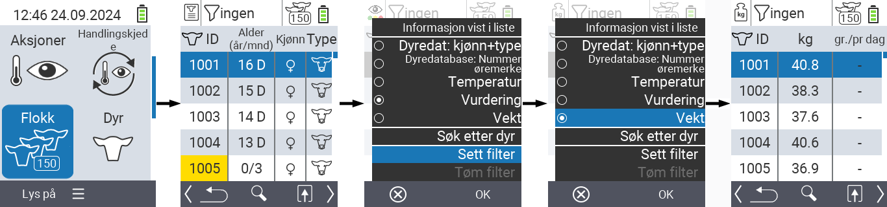
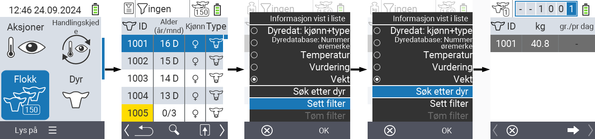
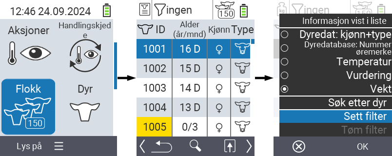
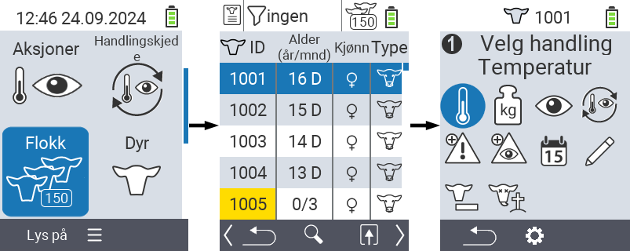

## Flokk {#herd}

Innenfor Flokk-menyelementet kan du se hele flokken din, søke etter individuelle dyr og vise viktig informasjon. Du har følgende muligheter:

- Se [dyredata](#view-animal-data)
- Se [temperaturdata](#display-temperature)
- Se [vurderingsdata](#view-rating)
- Se [vektsdata](#view-rating)
- [Søk etter dyr](#search-animal)
- Sett [filter](#set-filter)
- [Handlinger](#call-action-menu)

### Forberedende trinn {#preparatory-steps}

1. På hovedskjermen til din VitalControl-enhet, velg menyelementet  `` og trykk på ``-knappen.

2. Din flokkoversikt åpnes.

    

### Se dyredata {#view-animal-data}

1. Fullfør de forberedende trinnene.

2. Bruk `F3`-tasten &nbsp;&nbsp; for å åpne en popup-meny som viser informasjonskategoriene som kan vises for flokklisten. Bruk piltastene △ ▽ for å markere linjen `` eller `` og velg denne kategorien ved å trykke på den sentrale ``-knappen eller `F3`-tasten ``. De to valgmulighetene skiller seg i visningen av informasjonslinjen.

3. Dyredata vil nå vises som innhold i flokklisten.

4. Alternativt kan du bruke piltastene ◁ ▷ for å bytte mellom de forskjellige visningsalternativene.

    

{}
Som standard vises dyredata først. Bare når du har vekten vist, for eksempel, må du sette visningen av dyredata igjen.
{}

### Vise temperatur {#display-temperature}

1. Fullfør forberedelsestrinnene.

2. Bruk `F3`-tasten &nbsp;&nbsp; for å åpne en popup-meny som viser informasjonskategoriene som kan vises for besetningslisten. Bruk piltastene △ ▽ for å markere linjen `` og velg denne kategorien ved å trykke på den sentrale ``-knappen eller `F3`-tasten ``.

3. Temperaturdata vil nå vises som innhold i besetningslisten.

4. Alternativt kan du bruke piltastene ◁ ▷ for å bytte mellom de forskjellige visningsalternativene.

    

### Se vurdering {#view-rating}

1. Fullfør forberedelsestrinnene.

2. Bruk `F3`-tasten &nbsp;&nbsp; for å åpne en popup-meny som viser informasjonskategoriene som kan vises for besetningslisten. Bruk piltastene △ ▽ for å markere linjen `` og velg denne kategorien ved å trykke på den sentrale ``-knappen eller `F3`-tasten ``.

3. Vurderingsdata vil nå vises som innhold i besetningslisten.

4. Alternativt kan du bruke piltastene ◁ ▷ for å bytte mellom de forskjellige visningsalternativene.

    

### Vise vekt {#display-weight}

1. Fullfør forberedelsestrinnene.

2. Bruk `F3`-tasten &nbsp;&nbsp; for å åpne en popup-meny som viser informasjonskategoriene som kan vises for besetningslisten. Bruk piltastene △ ▽ for å markere linjen `` og velg denne kategorien ved å trykke på den sentrale ``-knappen eller `F3`-tasten ``.

3. Vektdata vil nå vises som innhold i besetningslisten.

4. Alternativt kan du bruke piltastene ◁ ▷ for å bytte mellom de forskjellige visningsalternativene.

### Søk etter dyr {#search-animal}

1. Fullfør forberedelsestrinnene.

2. Bruk `F3`-tasten &nbsp;&nbsp; for å åpne en popup-meny som viser ulike alternativer. Bruk piltastene △ ▽ for å markere funksjonen `` og aktiver søkefunksjonen ved å trykke på den sentrale ``-tasten eller `F3`-tasten ``. Alternativt kan du bruke `På/Av`-knappen  umiddelbart etter trinn én.

3. Bruk piltastene △ ▽ ◁ ▷ for å angi ønsket dyrenummer og bekreft med ``.

### Sett filter {#set-filter}

1. Fullfør forberedelsestrinnene.

2. Bruk `F3`-tasten &nbsp;&nbsp; for å åpne en popup-meny som viser ulike alternativer. Bruk piltastene △ ▽ for å markere funksjonen `` og aktiver filterfunksjonen ved å trykke på den sentrale ``-tasten eller `F3`-tasten ``.

3. Hvordan du bruker filteret finner du [her]().

### Åpne handlingsmeny {#call-action-menu}

Du har alltid muligheten til å åpne handlingsmenyen for et dyr.

1. Fullfør forberedelsestrinnene.

2. Velg et dyr fra listen med piltastene △ ▽ og bekreft med ``.

3. Handlingsmenyen er nå åpen. Hvordan du bruker denne finner du [her](../actions).

4. Gå tilbake til besetningslisten med `F3`-tasten.

