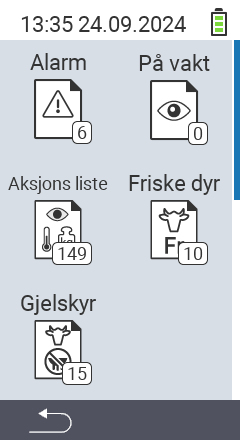

{}
Hvis du klikker på et menyelement, blir du omdirigert til en beskrivelse av den respektive funksjonen.
{}

<map name="workmap">
  <area shape="rect" coords="3,40,116,160" alt="Alarm liste" title="Sjekk ut alarm listen din&#10;Museklikk: åpne dokumentasjon" href="/no/docs/lists/alarm/">
  <area shape="rect" coords="3,160,116,280" alt="Handlingsliste" title="Sjekk ut handlingslisten din.&#10;Museklikk: åpne dokumentasjon" href="/no/docs/lists/actions/">
  <area shape="rect" coords="3,280,116,399" alt="Liste over sinte kyr" title="Sjekk ut listen over sinte kyr&#10;Museklikk: åpne dokumentasjon" href="/no/docs/lists/dry-cows/">

  <area shape="rect" coords="116,40,230,160" alt="På overvåkningsliste" title="Sjekk ut overvåkningslisten din&#10;Museklikk: åpne dokumentasjon" href="/no/docs/lists/on-watch/">
  <area shape="rect" coords="116,160,230,280" alt="Ferske kyr" title="Sjekk ut listen over ferske kyr&#10;Museklikk: åpne dokumentasjon" href="/no/docs/lists/fresh-cows/">

  <area shape="rect" coords="2,401,115,438" alt="Tilbake" title="Gå tilbake ett nivå" href="/no/docs/menu/mainmenu/">
</map>
