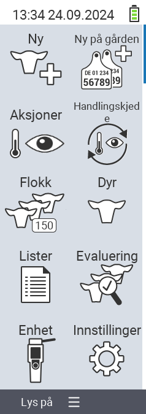

{}
Hvis du klikker på et menyelement, blir du omdirigert til en beskrivelse av den respektive funksjonen.
{}

<map name="workmap">
  <area shape="rect" coords="3,40,116,160" alt="Ny" title="Opprett nye dyr&#10;Museklikk: åpne dokumentasjon" href="/no/docs/new/">
  <area shape="rect" coords="3,160,116,280" alt="Handlinger" title="Handlinger på dyr&#10;Museklikk: åpne dokumentasjon" href="/no/docs/actions/">
  <area shape="rect" coords="3,280,116,400" alt="Flokk" title="Flokk meny&#10;Museklikk: åpne dokumentasjon" href="/no/docs/herd/">
  <area shape="rect" coords="3,400,116,520" alt="Lister" title="Dyrelister&#10;Museklikk: åpne dokumentasjon" href="/no/docs/lists/">
  <area shape="rect" coords="3,520,116,634" alt="Enhet" title="Enhet&#10;Museklikk: åpne dokumentasjon" href="/no/docs/device/">

  <area shape="rect" coords="116,40,230,160" alt="Ny på gården" title="Tilgang til dyr&#10;Museklikk: åpne dokumentasjon" href="/no/docs/new-on-farm/">
  <area shape="rect" coords="116,160,230,280" alt="Handlingskjede" title="Handlingskjede&#10;Museklikk: åpne dokumentasjon" href="/no/docs/chain-of-actions/">
  <area shape="rect" coords="116,280,230,400" alt="Dyr" title="Dyr&#10;Museklikk: åpne dokumentasjon" href="/no/docs/animal/">
  <area shape="rect" coords="116,400,230,520" alt="Evaluering" title="Evaluering&#10;Museklikk: åpne dokumentasjon" href="/no/docs/evaluation/">
  <area shape="rect" coords="116,520,230,634" alt="Innstillinger" title="Innstillinger&#10;Museklikk: åpne dokumentasjon" href="/no/docs/settings/">
</map>
