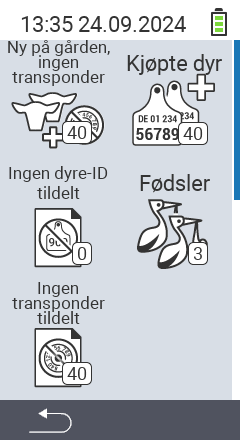

{}
Hvis du klikker på et menyelement, blir du omdirigert til en beskrivelse av den respektive funksjonen.
{}

<map name="workmap">
  <area shape="rect" coords="3,40,116,160" alt="Ny på gården, ingen transponder" title="Her tildeler du en transponder til nye dyr uten transponder&#10;Museklikk: åpne dokumentasjon" href="/no/docs/new-on-farm/new-no-transponder/">
  <area shape="rect" coords="3,160,116,280" alt="Ingen nasjonal dyre-ID tildelt" title="Her kan du se alle dyr som ennå ikke har fått tildelt en nasjonal dyre-ID og tildele en nasjonal dyre-ID&#10;Museklikk: åpne dokumentasjon" href="/no/docs/new-on-farm/no-national-animal-id-assigned/">
  <area shape="rect" coords="3,280,116,399" alt="Ingen transponder tildelt" title="Her kan du se alle dyr som ennå ikke har fått tildelt en transponder og tildele en transponder til dem&#10;Museklikk: åpne dokumentasjon" href="/no/docs/new-on-farm/no-transponder-assigned/">

  <area shape="rect" coords="116,40,230,160" alt="Kjøpte dyr" title="Her kan du se dine nåværende kjøp og eksportere dataene&#10;Museklikk: åpne dokumentasjon" href="/no/docs/new-on-farm/purchased-animals/">
  <area shape="rect" coords="116,160,230,280" alt="Fødsler" title="Her kan du se dine fødsler og lage en eksportfil&#10;Museklikk: åpne dokumentasjon" href="/no/docs/new-on-farm/births/">
  <area shape="rect" coords="1,401,100,439" alt="Tilbake" title="Hopp tilbake ett nivå&#10;Museklikk: til dokumentasjonen" href="/no/docs/menu/mainmenu/">
</map>
