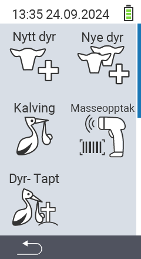

Via hovedmenyelementet  `` kommer du til en undermeny, hvor 5 underpunkter presenteres for valg:

<map name="workmap">
  <area shape="rect" coords="3,40,116,160" alt="Nytt dyr" title="Hvordan registrere et nytt dyr ved bruk av VitalControl-enheten&#10;Museklikk: åpne dokumentasjon" href="/no/docs/new/animal/">
  <area shape="rect" coords="3,160,116,280" alt="Kalving" title="Hvordan registrere en ny kalving ved bruk av VitalControl-enheten&#10;Museklikk: åpne dokumentasjon" href="/no/docs/new/calving/">
  <area shape="rect" coords="3,280,116,399" alt="Dyretap" title="Hvordan registrere tap av et dyr ved bruk av VitalControl-enheten&#10;Museklikk: åpne dokumentasjon" href="/no/docs/new/animal-loss/">

  <area shape="rect" coords="116,40,230,160" alt="Nye dyr" title="Hvordan opprette flere nye dyr på VitalControl-enheten ved bruk av en enkelt handling&#10;Museklikk: åpne dokumentasjon" href="/no/docs/new/animals/">
  <area shape="rect" coords="116,160,230,280" alt="Masseopptak" title="Bruk strekkodeskanneren for å registrere en rekke dyr&#10;Museklikk: åpne dokumentasjon" href="/no/docs/new/bulk-recording/">

  <area shape="rect" coords="1,401,100,439" alt="Tilbake" title="Gå tilbake ett nivå&#10;Museklikk: til dokumentasjonen" href="/no/docs/menu/mainmenu/">
</map>

{}
Hver undermeny har sitt eget ikon. Flytt musepekeren over et ikon i grafikken ovenfor og la den hvile et øyeblikk. En verktøytips vises, som viser informasjon for den valgte undermenyen. Hvis du klikker på et av ikonene, blir du videresendt til en beskrivelse av det valgte undermenypunktet.
{}

