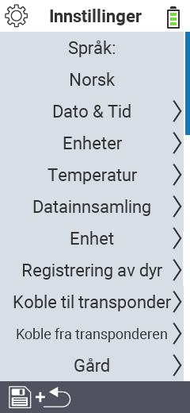

{}
Hvis du klikker på et menyelement, blir du omdirigert til en beskrivelse av den respektive funksjonen.
{}

<map name="workmap">
  <area shape="rect" coords="2,40,230,120" alt="Språk" title="Sett og lagre språket for brukergrensesnittet på din VitalControl-enhet permanent&#10;Museklikk: åpne dokumentasjon" href="/no/docs/settings/language/">
  <area shape="rect" coords="2,120,230,160" alt="Dato & Tid" title="Her setter du dato og tid&#10;Museklikk: åpne dokumentasjon" href="/no/docs/settings/datetime/">
  <area shape="rect" coords="2,160,230,200" alt="Enheter" title="Her velger du enheter for temperatur og masse&#10;Museklikk: åpne dokumentasjon" href="/no/docs/settings/units/">
  <area shape="rect" coords="2,200,230,240" alt="Temperatur" title="Sett temperaturinnstillingene for bruken av din VitalControl-enhet&#10;Museklikk: åpne dokumentasjon" href="/no/docs/settings/temperature/">
   <area shape="rect" coords="2,240,230,280" alt="Dataregistrering" title="Her lagrer du relevant informasjon for dyredatainnsamling&#10;Museklikk: åpne dokumentasjon" href="/no/docs/settings/data-acquisition/">
   <area shape="rect" coords="2,280,230,320" alt="Enhet" title="Her kan du justere ulike enhetsinnstillinger&#10;Mausklick: zur Dokumentation" href="/no/docs/settings/device/">
   <area shape="rect" coords="2,320,230,360" alt="Registrering av dyr" title="Her kan du justere flere fabrikkinnstilte standarder angående registrering av nye dyr til kravene på gården din.&#10;Museklikk: åpne dokumentasjon" href="/no/docs/settings/animal-registration/">
   <area shape="rect" coords="2,360,230,400" alt="Koble transponder" title="Sett tildelingen av transponderen på din VitalControl-enhet&#10;Museklikk: åpne dokumentasjon" href="/no/docs/settings/transponder-linkage/">
   <area shape="rect" coords="2,400,230,439" alt="Koble fra transponder" title="Angi hvordan dyre-ID-en vil bli tildelt etter at transponderen er koblet fra&#10;Museklikk: åpne dokumentasjon" href="/no/docs/settings/transponder-linkage/">
   <area shape="rect" coords="2,440,230,480" alt="Gård" title="Lagre din offisielle tolv-sifrede nasjonale gårds-ID permanent på VitalControl-enheten&#10;Museklikk: åpne dokumentasjon" href="/no/docs/settings/farm-number/">
   <area shape="rect" coords="2,482,123,519" alt="Tilbake" title="Hopp tilbake ett nivå" href="/no/docs/menu/mainmenu/">
</map>

