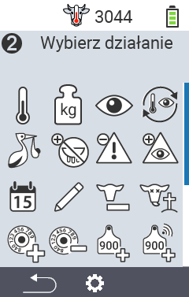
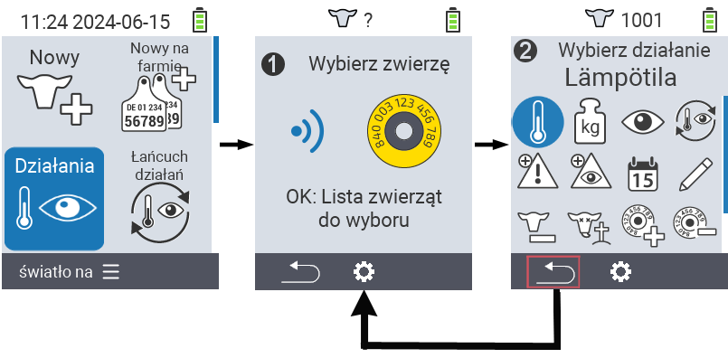
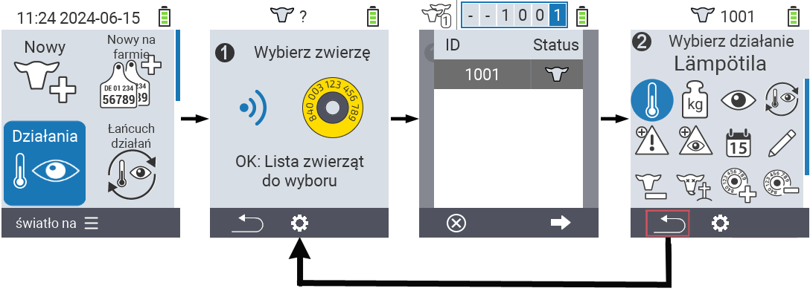

## Dostępne działania {#available-actions}

W zależności od rodzaju zwierzęcia, możesz wykonać do 16 różnych działań na zwierzęciu.

<map name="workmap">
  <area shape="rect" coords="3,100,60,165" alt="Temperatura" title="Zmierz gorączkę u swoich zwierząt&#10;Kliknięcie myszą: otwórz dokumentację" href="/en/docs/actions/measure-temperature/">
  <area shape="rect" coords="60,100,118,165" alt="Ważenie" title="Zarejestruj wagę swoich zwierząt&#10;Kliknięcie myszą: otwórz dokumentację" href="/en/docs/actions/record-weight/">
  <area shape="rect" coords="118,100,174,165" alt="Ocena" title="Oceń swoje zwierzęta&#10;Kliknięcie myszą: otwórz dokumentację" href="/en/docs/actions/rating/">
  <area shape="rect" coords="174,100,230,165" alt="Łańcuch działań" title="Zastosowanie i ustawienie łańcucha działań&#10;Kliknięcie myszą: otwórz dokumentację" href="/en/docs/chain-of-actions/">
   <area shape="rect" coords="3,165,60,225" alt="Poród" title="Zarejestruj poród&#10;Kliknięcie myszą: otwórz dokumentację" href="/en/docs/actions/calving/">
   <area shape="rect" coords="60,165,120,225" alt="Zasuszanie" title="Zasusz krowę lub dodaj ją do listy świeżych krów&#10;Kliknięcie myszą: otwórz dokumentację" href="/en/docs/actions/dry-off/">
   <area shape="rect" coords="120,165,175,225" alt="Alarm" title="Dodaj i usuń zwierzęta z listy alarmowej&#10;Kliknięcie myszą: otwórz dokumentację" href="/en/docs/actions/alarm/">
   <area shape="rect" coords="175,165,230,225" alt="Pod obserwacją" title="Dodaj zwierzęta do listy pod obserwacją lub je usuń&#10;Kliknięcie myszą: otwórz dokumentację" href="/en/docs/actions/on-watch/">
   <area shape="rect" coords="3,225,60,280" alt="Historia zwierzęcia" title="Zobacz historię zwierzęcia&#10;Kliknięcie myszą: otwórz dokumentację" href="/en/docs/actions/animal-history/">
   <area shape="rect" coords="60,225,120,280" alt="Edytuj" title="Edytuj dane wybranego zwierzęcia&#10;Kliknięcie myszą: otwórz dokumentację" href="/en/docs/actions/edit/">
   <area shape="rect" coords="120,225,175,280" alt="Wyrejestruj" title="Wyrejestruj zwierzę&#10;Kliknięcie myszą: otwórz dokumentację" href="/en/docs/actions/unregister/">
   <area shape="rect" coords="175,225,230,280" alt="Utrata zwierzęcia" title="Zarejestruj utratę zwierzęcia&#10;Kliknięcie myszą: otwórz dokumentację" href="/en/docs/actions/animal-loss/">
   <area shape="rect" coords="3,280,60,337" alt="Połącz transponder" title="Przypisz transponder do zwierzęcia&#10;Kliknięcie myszą: otwórz dokumentację" href="/en/docs/actions/link-transponder/">
   <area shape="rect" coords="55,280,120,337" alt="Odłącz transponder" title="Usuń połączenie transpondera ze zwierzęciem&#10;Kliknięcie myszą: otwórz dokumentację" href="/en/docs/actions/unlink-transponder/">
   <area shape="rect" coords="120,280,175,337" alt="Ręczne przypisanie ID zwierzęcia" title="Przypisz krajowy identyfikator zwierzęcia do zwierzęcia, które go nie posiada&#10;Kliknięcie myszą: otwórz dokumentację" href="/en/docs/actions/link-animal-id/#link-animal-id">
   <area shape="rect" coords="175,280,230,337" alt="Przypisanie ID zwierzęcia za pomocą skanu" title="Przypisz krajowy identyfikator zwierzęcia do zwierzęcia, które go nie posiada&#10;Kliknięcie myszą: otwórz dokumentację" href="/en/docs/actions/link-animal-id/#link-animal-id-with-electronic-ear-tag-scan">

   <area shape="rect" coords="100,340,140,375" alt="Settings" title="Call up the settings&#10;Mouse click: to the documentation" href="/en/docs/actions/setting/">
</map>

{}
Każda akcja jest identyfikowana przez symbol. Przesuń wskaźnik myszy nad symbolem w poniższej grafice i pozostaw go na chwilę. Pojawi się dymek z informacją o danej akcji. Jeśli klikniesz na jeden z symboli, zostaniesz przekierowany do opisu danej akcji.
{}

## Ogólna procedura {#general-procedure}

W menu   `` możesz wybrać następne zwierzę w dowolnym momencie bez konieczności opuszczania pozycji menu Akcje. Aby wybrać następne zwierzę, postępuj w następujący sposób:

1. Wybierz pozycję menu   `` na głównym ekranie urządzenia VitalControl i naciśnij przycisk ``.

2. Zeskanuj zwierzę za pomocą transpondera lub wybierz zwierzę z listy. Potwierdź, naciskając `` i wybierz zwierzę za pomocą przycisków strzałek △ ▽. Potwierdź, naciskając ``.

3. Otworzy się submenu, w którym znajdziesz ikony dla licznych akcji zwierzęcych. Użyj przycisków strzałek, aby wybrać żądaną akcję i rozpocznij akcję, naciskając przycisk ``. W zależności od wybranej akcji pojawi się jeden lub więcej ekranów lub okno pop-up.

4. Jeśli chcesz, możesz teraz wybrać i wykonać inną akcję dla bieżącego zwierzęcia.

5. Po wykonaniu żądanej akcji (akcji) dla zwierzęcia, wróć do kroku 2 'Wybór zwierzęcia'. Aby to zrobić, naciśnij lewy przycisk `F1` poniżej symbolu `` w lewym dolnym rogu stopki.

6. Okno z kroku drugiego otworzy się ponownie automatycznie i możesz wybrać następne zwierzę lub wrócić do głównego menu, naciskając przycisk `F1` poniżej symbolu ``.



{}

{}
{}

{}


Rozumiem. Wklej treść Markdown, którą chcesz przetłumaczyć.
