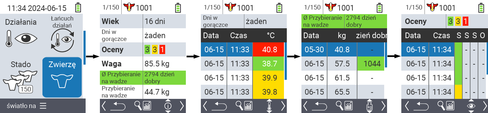
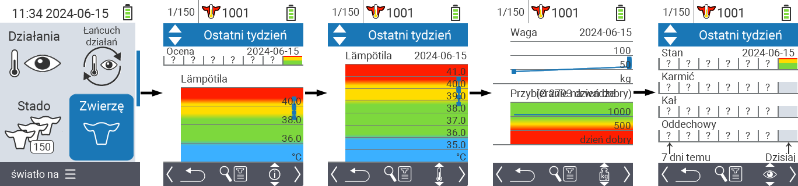
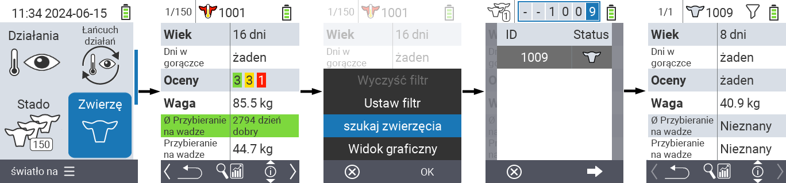

## Zwierzę {#animal}

Funkcja indywidualnego zwierzęcia pozwala na przeglądanie ważnych informacji o wadze, temperaturze i ocenie każdego zwierzęcia. Zawsze masz możliwość wyświetlenia informacji w formie graficznej lub jako listę. Aby skorzystać z funkcji pojedynczego zwierzęcia, postępuj zgodnie z poniższymi krokami:

1. Na głównym ekranie urządzenia VitalControl wybierz pozycję menu  `` i naciśnij przycisk ``.

2. Otworzy się przegląd najważniejszych informacji o zwierzęciu. Górna krawędź ekranu pokazuje, które zwierzę aktualnie oglądasz. Użyj klawisza `F3`, aby wybrać między informacjami o zwierzęciu , temperaturą , wagą  i oceną .

{}
W ramach każdego wyświetlania informacji masz możliwość [wyszukiwania zwierzęcia](#search-animal), ustawienia [filtra](#set-filter) i przełączenia na [widok graficzny](#set-graphical-view).
Możesz także przełączać się między poszczególnymi zwierzętami w dowolnym momencie za pomocą klawiszy strzałek ◁ ▷.
{}

### Ustaw widok graficzny {#set-graphical-view}

1. Naciśnij środkowy górny przycisk `On/Off` , aby otworzyć menu podręczne. W tym menu możesz wybrać między funkcjami ``, `` lub ``.

2. Wybierz `` za pomocą klawiszy strzałek △ ▽ i potwierdź ``.

### Wyszukaj zwierzę {#search-animal}

1. Naciśnij środkowy górny przycisk `On/Off`  aby otworzyć menu pop-up. W tym menu możesz wybrać między funkcjami ``, `` lub ``.

2. Wybierz `` za pomocą klawiszy strzałek △ ▽ i potwierdź ``.

3. Użyj klawiszy strzałek △ ▽ ◁ ▷, aby wybrać żądany numer zwierzęcia i potwierdź ``

### Ustaw filtr {#set-filter}

1. Naciśnij środkowy górny przycisk `On/Off`  aby otworzyć menu pop-up. W tym menu możesz wybrać między funkcjami ``, `` lub ``.

2. Wybierz `` za pomocą klawiszy strzałek △ ▽ i potwierdź ``.
Instrukcje dotyczące korzystania z filtra znajdziesz [tutaj]().

