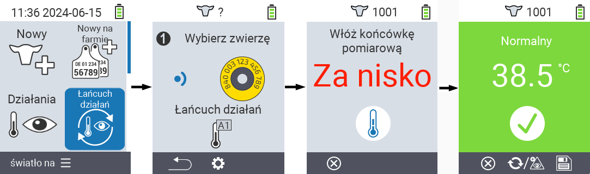
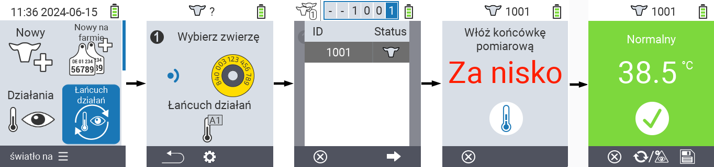
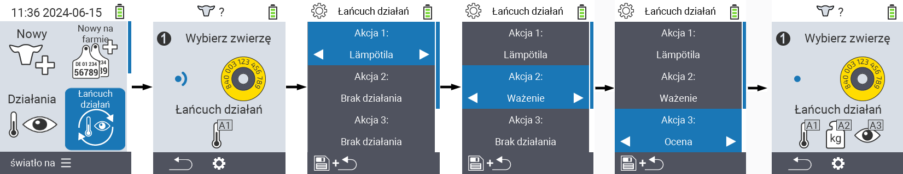

## Łańcuch działań {#chain-of-actions}

Łańcuch działań pozwala automatycznie wykonać kilka działań na zwierzęciu jedno po drugim. Na przykład, możesz wybrać działania `` i ``. Jeśli następnie wykonasz łańcuch działań, możesz najpierw zmierzyć temperaturę swojego zwierzęcia, a następnie natychmiast zanotować ocenę.

### Użyj łańcucha działań {#use-chain-of-actions}

1. Na głównym ekranie urządzenia VitalControl wybierz pozycję menu &nbsp;&nbsp; `` i naciśnij przycisk ``.

2. Zeskanuj zwierzę za pomocą transpondera lub potwierdź przyciskiem `` i użyj klawiszy strzałek △ ▽ ◁ ▷, aby wprowadzić żądany identyfikator zwierzęcia.

3. Łańcuch działań jest teraz wykonywany. Gdy wszystkie działania w łańcuchu działań zostaną wykonane, można bezpośrednio wybrać następne zwierzę.



{}

{}
{}

{}


### Ustaw łańcuch działań {#set-chain-of-actions}

1. Na głównym ekranie urządzenia VitalControl wybierz pozycję menu &nbsp;&nbsp; `` i naciśnij przycisk ``.

2. Użyj przycisku `F2` &nbsp;&nbsp; (``).

3. Pojawi się ekran nakładki. Użyj klawiszy strzałek △ ▽, aby wybrać jedną z wymienionych akcji 1 - 4 (możesz wykonać do czterech akcji z rzędu). Użyj klawiszy strzałek ◁ ▷, aby wybrać żądaną akcję dla odpowiedniej akcji. Zapisz ustawienia klawiszem `F1` &nbsp;&nbsp;.

4. Jeśli chcesz zresetować cały łańcuch akcji, wybierz opcję `` w podmenu za pomocą klawiszy strzałek △ ▽ i potwierdź klawiszem ``.

    

{}
W ramach poszczególnych akcji masz te same opcje ustawień, które opisano w rozdziale [Akcje](../actions) dla każdej indywidualnej akcji.
{}

{}
Symbole na ekranie startowym łańcucha akcji pokazują, które akcje ustawiłeś i w jakiej kolejności.
{}
