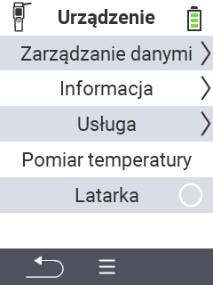

{}
Jeśli klikniesz element menu, zostaniesz przekierowany do opisu odpowiedniej funkcji.
{}

<map name="workmap">
  <area shape="rect" coords="2,40,238,80" alt="Zarządzanie danymi" title="Uruchom kopie zapasowe danych, eksportuj swoje dane i zresetuj urządzenie&#10;Kliknięcie myszą: otwórz dokumentację" href="/pl/docs/device/data-management/">
  <area shape="rect" coords="2,80,238,120" alt="Informacje" title="Zobacz ważne informacje o oprogramowaniu i sprzęcie&#10;Kliknięcie myszą: otwórz dokumentację" href="/pl/docs/device/info/">
  <area shape="rect" coords="2,120,238,160" alt="Serwis" title="Sprawdź sterowniki urządzenia, zaktualizuj oprogramowanie układowe i wykonaj test zasięgu&#10;Kliknięcie myszą: otwórz dokumentację" href="/pl/docs/device/service/">
  <area shape="rect" coords="2,160,238,200" alt="Pomiar temperatury" title="Przetestuj pomiar temperatury swojego urządzenia&#10;Kliknięcie myszą: otwórz dokumentację" href="/pl/docs/device/temperature-measurement/">
  <area shape="rect" coords="2,200,238,240" alt="Latarka" title="Włącz lub wyłącz światło w swoim urządzeniu VitalControl&#10;Kliknięcie myszą: otwórz dokumentację" href="/pl/docs/device/flashlight/">

  <area shape="rect" coords="2,282,97,318" alt="Wstecz" title="Cofnij się o jeden poziom" href="/pl/docs/menu/mainmenu/">
</map>
