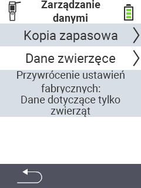

{}
Jeśli klikniesz na element menu, zostaniesz przekierowany do opisu odpowiedniej funkcji.
{}

<map name="workmap">
  <area shape="rect" coords="2,40,238,80" alt="Kopia zapasowa danych" title="Instrukcje dotyczące tworzenia kopii zapasowej można znaleźć tutaj&#10;Kliknięcie myszą: otwórz dokumentację" href="/pl/docs/device/data-management/data-backup/">

  <area shape="rect" coords="2,80,238,120" alt="Dane zwierząt" title="Instrukcje dotyczące przywracania kopii zapasowej można znaleźć tutaj&#10;Kliknięcie myszą: otwórz dokumentację" href="/pl/docs/device/data-management/animal-data/">

  <area shape="rect" coords="2,120,238,200" alt="Reset do ustawień fabrycznych" title="Wszystkie informacje i instrukcje dotyczące resetowania urządzenia i danych zwierząt można znaleźć tutaj&#10;Kliknięcie myszą: otwórz dokumentację" href="/pl/docs/reset/">

  <area shape="rect" coords="2,282,120,319" alt="Powrót" title="Wszystkie informacje i instrukcje dotyczące eksportowania danych zwierząt można znaleźć tutaj&#10;Kliknięcie myszą: otwórz dokumentację" href="/pl/docs/device/">
</map>
