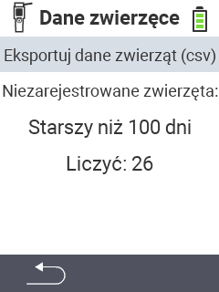

<map name="workmap">
  <area shape="rect" coords="2,40,238,80" alt="Eksport danych zwierząt (csv)" title="Eksportuj dane swoich zwierząt&#10;Kliknięcie myszą: otwórz dokumentację" href="/en/docs/data-export/usb-drive/">

  <area shape="rect" coords="2,80,238,200" alt="Wyrejestruj zwierzęta" title="Określ wiek, od którego zwierzęta powinny być wyrejestrowane&#10;Kliknięcie myszą: otwórz dokumentację" href="/en/docs/device/data-management/animal-data/unregister-animal/">

  <area shape="rect" coords="2,282,120,319" alt="Wstecz" title="Wszystkie informacje i instrukcje dotyczące eksportu danych zwierząt można znaleźć tutaj&#10;Kliknięcie myszą: otwórz dokumentację" href="/en/docs/device/data-management/">
</map>
