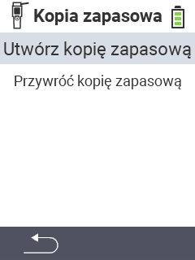

<map name="workmap">
  <area shape="rect" coords="2,40,238,80" alt="Utwórz kopię zapasową" title="Instrukcje dotyczące tworzenia kopii zapasowej można znaleźć tutaj&#10;Kliknięcie myszą: otwórz dokumentację" href="/pl/docs/backup/backup/">

  <area shape="rect" coords="2,80,238,120" alt="Przywróć kopię zapasową" title="Instrukcje dotyczące przywracania kopii zapasowej można znaleźć tutaj&#10;Kliknięcie myszą: otwórz dokumentację" href="/pl/docs/backup/restore/">

  <area shape="rect" coords="2,282,120,319" alt="Wstecz" title="Cofnij się o jeden poziom&#10;Kliknięcie myszą: otwórz dokumentację" href="/pl/docs/device/data-management/">
</map>
