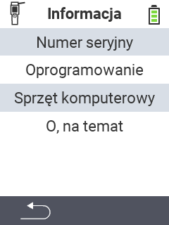

{}
Jeśli klikniesz element menu, zostaniesz przekierowany do opisu odpowiedniej funkcji.
{}

<map name="workmap">
  <area shape="rect" coords="2,40,238,80" alt="Numer seryjny" title="Aby uzyskać numer seryjny swojego urządzenia, kliknij tutaj&#10;Kliknięcie myszą: do dokumentacji" href="/pl/docs/device/info/serial-number/">
  <area shape="rect" coords="2,80,238,120" alt="Oprogramowanie" title="Instrukcje dotyczące wyświetlania wersji oprogramowania można znaleźć tutaj&#10;Kliknięcie myszą: do dokumentacji" href="/pl/docs/firmware/versions/">
  <area shape="rect" coords="2,120,238,160" alt="Sprzęt" title="Aby uzyskać dostęp do informacji o sprzęcie swojego urządzenia, kliknij tutaj&#10;Kliknięcie myszą: do dokumentacji" href="/pl/docs/device/info/hardware/">
  <area shape="rect" coords="2,160,238,200" alt="O programie" title="Wywołaj informacje o dostawcy&#10;Kliknięcie myszą: do dokumentacji" href="/pl/docs/device/info/about/">

  <area shape="rect" coords="2,282,120,319" alt="Wstecz" title="Wróć na poziom&#10;Kliknięcie myszą: otwórz dokumentację" href="/pl/docs/device/">
</map>
