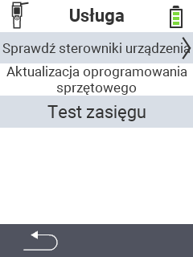

{}
Jeśli klikniesz element menu, zostaniesz przekierowany do opisu odpowiedniej funkcji.
{}

<map name="workmap">
  <area shape="rect" coords="2,42,238,82" alt="Sprawdź sterowniki urządzeń" title="Instrukcje dotyczące sprawdzania sterowników urządzeń można znaleźć tutaj&#10;Kliknięcie myszą: otwórz dokumentację" href="/en/docs/diagnosis/hardware/">
  <area shape="rect" coords="2,82,238,122" alt="Aktualizacja oprogramowania układowego" title="Instrukcje dotyczące aktualizacji oprogramowania układowego można znaleźć tutaj&#10;Kliknięcie myszą: otwórz dokumentację" href="/en/docs/firmware/update/">
  <area shape="rect" coords="2,122,238,162" alt="Test zasięgu" title="Instrukcje dotyczące przeprowadzania testu zasięgu można znaleźć tutaj&#10;Kliknięcie myszą: otwórz dokumentację" href="/en/docs/diagnosis/rfid-scan/">

  <area shape="rect" coords="2,282,120,319" alt="Powrót" title="Powrót na poziom&#10;Kliknięcie myszą: otwórz dokumentację" href="/en/docs/device/">
</map>
