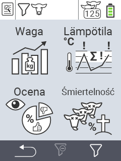

{}
Jeśli klikniesz element menu, zostaniesz przekierowany do opisu odpowiedniej funkcji.
{}

<map name="workmap">
  <area shape="rect" coords="3,40,116,160" alt="Waga" title="Oceń swoje przechowywane dane w sekcji Waga&#10;Kliknięcie myszą: otwórz dokumentację" href="/pl/docs/evaluation/weight/">
  <area shape="rect" coords="3,160,116,279" alt="Ocena" title="Oceń swoje przechowywane dane w sekcji oceny&#10;Kliknięcie myszą: otwórz dokumentację" href="/pl/docs/evaluation/rating/">

  <area shape="rect" coords="116,40,238,160" alt="Temperatura" title="Oceń swoje przechowywane dane w sekcji Temperatura&#10;Kliknięcie myszą: otwórz dokumentację" href="/pl/docs/evaluation/temperature/">
  <area shape="rect" coords="116,160,238,279" alt="Śmiertelność" title="Oceń swoje przechowywane dane w sekcji śmiertelności&#10;Kliknięcie myszą: otwórz dokumentację" href="/pl/docs/evaluation/mortality/">

  <area shape="rect" coords="150,282,238,319" alt="Filtr" title="Ustaw filtr&#10;Kliknięcie myszą: do dokumentacji" href="/pl/docs/filter">
  <area shape="rect" coords="2,282,95,319" alt="Wstecz" title="Cofnij się o jeden poziom&#10;Kliknięcie myszą: do dokumentacji" href="/pl/docs/menu/mainmenu/">
</map>
