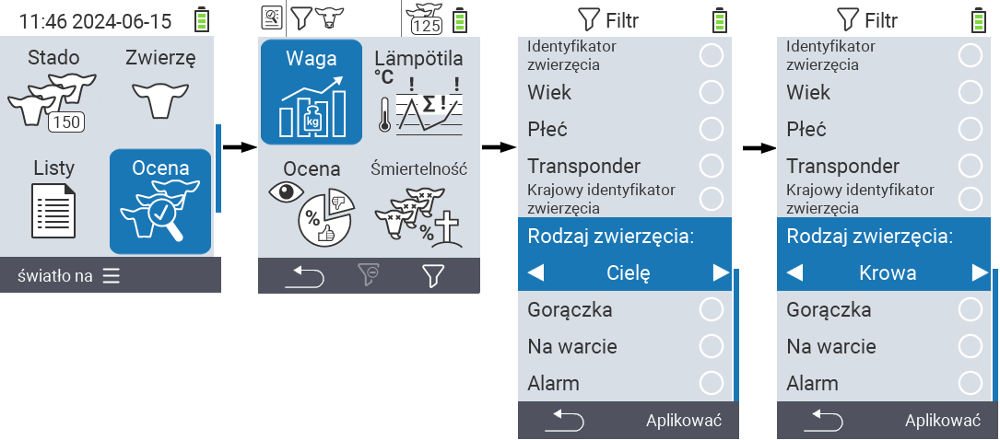
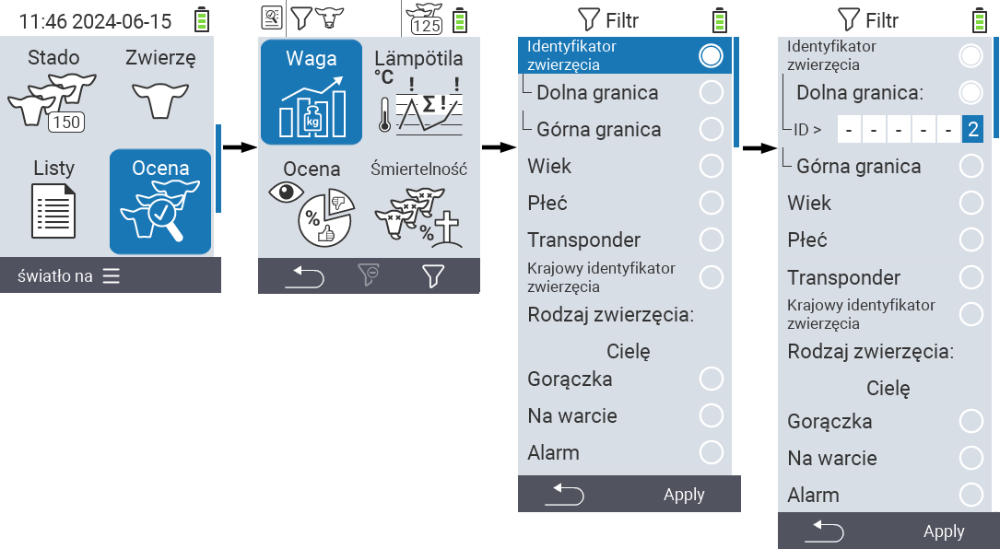
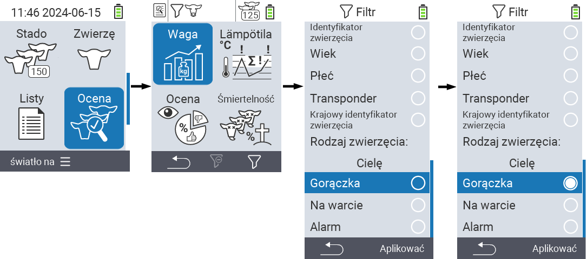

## Zastosowanie filtrów {#applying-filters}

{}
Filtr pomaga w dokonaniu selekcji za pomocą kryteriów filtracji w elementach menu ``, `` i `` urządzenia VitalControl. Gdy tylko zastosujesz filtr, na górze ekranu pojawiają się symbole różnych kryteriów filtracji. Te symbole pomagają dowiedzieć się, czy i które kryteria filtracji są aktywne. Na przykład, jeśli ustawisz filtr `` na męski, urządzenie będzie używać tylko męskich zwierząt. Na przykład, jeśli również aktywujesz filtr ``, urządzenie będzie używać tylko męskich zwierząt znajdujących się na liście obserwacyjnej.
{}

Aby utworzyć filtr w ocenach, postępuj zgodnie z poniższymi krokami:

1. W podmenu należącym do górnego elementu menu  `` naciśnij klawisz `F3`  raz. W podmenu należącym do górnych elementów menu  `` i  ``, musisz nacisnąć klawisz dwa razy.

2. Otwiera się podmenu, w którym możesz ustawić wszystkie opcje filtra. Możesz filtrować według ``, ``, ``, ``, ``, ``, ``, `` i ``.

3. Dla filtrów ``, ``, `` i `` przejdź do odpowiedniego obszaru i potwierdź ``. Użyj klawiszy strzałek ◁ ▷, aby określić żądane ustawienie. Użyj klawisza `F3` ``, aby zastosować wybrane ustawienie. Aby odrzucić zmiany filtra, naciśnij klawisz `F1` &nbsp;&nbsp;.

4. Dla filtrów `` i `` wybierz odpowiednie kryterium i potwierdź ``. Zostaną teraz wyświetlone dolna i górna granica. Przejdź do żądanej granicy za pomocą klawiszy strzałek △ ▽ i potwierdź, naciskając dwukrotnie ``. Teraz możesz ustawić żądaną liczbę za pomocą klawiszy strzałek ◁ ▷ i klawiszy strzałek △ ▽. Gdy wszystkie ustawienia są poprawne, naciśnij ponownie ``, aby opuścić tryb ustawień i zastosować wybrane filtry za pomocą klawisza `F3` ``. Używając klawisza `F1` &nbsp;&nbsp;, możesz odrzucić swoje zmiany, jeśli chcesz.

5. Dla filtrów ``, `` i `` istnieje możliwość wyłączenia lub włączenia ich zastosowania. Aby to zrobić, wybierz odpowiedni filtr i potwierdź ``. Filtr jest teraz aktywny. Potwierdź ponownie ``, aby dezaktywować filtr.

6. Po ustawieniu wszystkich filtrów użyj klawisza `F3` ``, aby zastosować zdefiniowane filtry lub naciśnij klawisz `F1` , aby odrzucić zmiany w filtrach.
