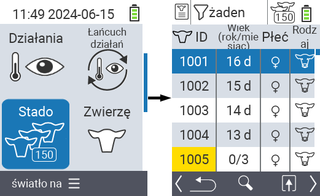
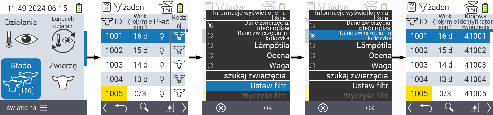
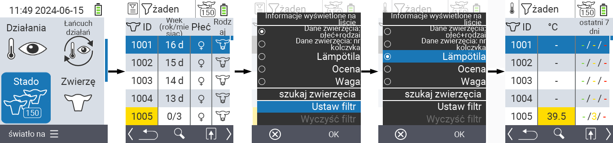
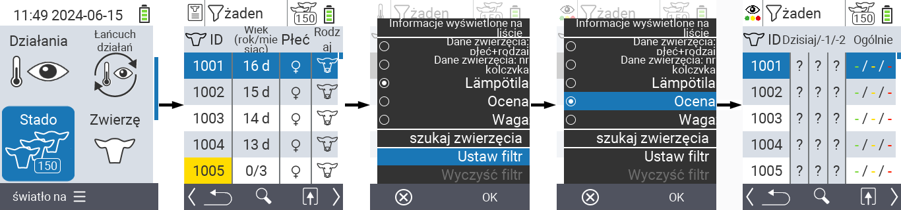
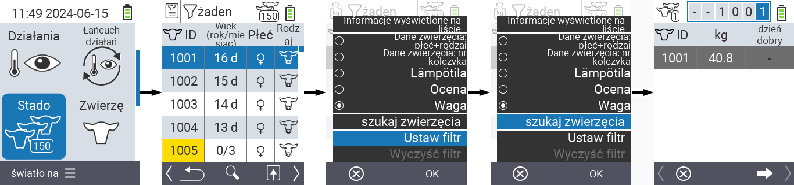
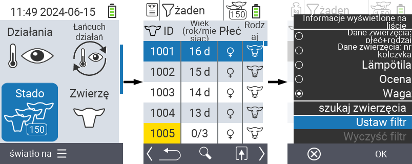
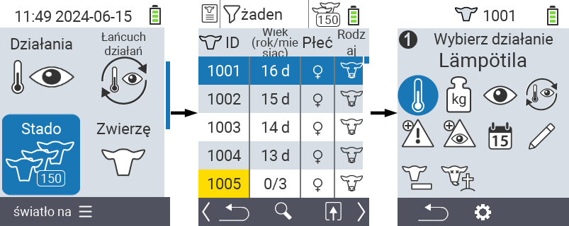

## Stado {#herd}

W menu Stado możesz zobaczyć całe swoje stado, wyszukać pojedyncze zwierzęta i wyświetlić ważne informacje. Masz następujące możliwości:

- Zobacz [dane zwierząt](#view-animal-data)
- Zobacz [dane temperatury](#display-temperature)
- Zobacz [dane oceny](#view-rating)
- Zobacz [dane wagi](#view-rating)
- [Wyszukaj zwierzę](#search-animal)
- Ustaw [filtr](#set-filter)
- [Akcje](#call-action-menu)

### Kroki przygotowawcze {#preparatory-steps}

1. Na głównym ekranie urządzenia VitalControl wybierz pozycję menu  `` i naciśnij przycisk ``.

2. Otworzy się przegląd twojego stada.

    

### Zobacz dane zwierząt {#view-animal-data}

1. Wykonaj kroki przygotowawcze.

2. Użyj klawisza `F3` &nbsp;&nbsp; aby wywołać menu popup, które wyświetla kategorie informacji, które mogą być wyświetlane dla listy stada. Użyj klawiszy strzałek △ ▽, aby podświetlić linię `` lub `` i wybierz tę kategorię, naciskając centralny przycisk `` lub klawisz `F3` ``. Dwie opcje wyboru różnią się w wyświetlaniu paska informacji.

3. Dane zwierząt zostaną teraz wyświetlone jako zawartość listy stada.

4. Alternatywnie możesz użyć klawiszy strzałek ◁ ▷, aby przełączać się między różnymi opcjami wyświetlania.

    

{}
Domyślnie najpierw wyświetlane są dane zwierząt. Dopiero gdy masz wyświetloną wagę, na przykład, musisz ponownie ustawić wyświetlanie danych zwierząt.
{}

### Wyświetlanie temperatury {#display-temperature}

1. Wykonaj kroki przygotowawcze.

2. Użyj klawisza `F3` &nbsp;&nbsp; aby wywołać menu podręczne, które wyświetla kategorie informacji, które mogą być wyświetlane na liście stada. Użyj klawiszy strzałek △ ▽, aby podświetlić linię `` i wybierz tę kategorię, naciskając środkowy przycisk `` lub klawisz `F3` ``.

3. Dane dotyczące temperatury będą teraz wyświetlane jako zawartość listy stada.

4. Alternatywnie, możesz użyć klawiszy strzałek ◁ ▷, aby przełączać się między różnymi opcjami wyświetlania.

    

### Wyświetlanie oceny {#view-rating}

1. Wykonaj kroki przygotowawcze.

2. Użyj klawisza `F3` &nbsp;&nbsp; aby wywołać menu podręczne, które wyświetla kategorie informacji, które mogą być wyświetlane na liście stada. Użyj klawiszy strzałek △ ▽, aby podświetlić linię `` i wybierz tę kategorię, naciskając środkowy przycisk `` lub klawisz `F3` ``.

3. Dane dotyczące oceny będą teraz wyświetlane jako zawartość listy stada.

4. Alternatywnie, możesz użyć klawiszy strzałek ◁ ▷, aby przełączać się między różnymi opcjami wyświetlania.

    

### Wyświetlanie wagi {#display-weight}

1. Wykonaj kroki przygotowawcze.

2. Użyj klawisza `F3` &nbsp;&nbsp; aby wywołać menu podręczne, które wyświetla kategorie informacji, które mogą być wyświetlane na liście stada. Użyj klawiszy strzałek △ ▽, aby podświetlić linię `` i wybierz tę kategorię, naciskając środkowy przycisk `` lub klawisz `F3` ``.

3. Dane dotyczące wagi będą teraz wyświetlane jako zawartość listy stada.

4. Alternatywnie, możesz użyć klawiszy strzałek ◁ ▷, aby przełączać się między różnymi opcjami wyświetlania.

    

### Wyszukaj zwierzę {#search-animal}

1. Wykonaj kroki przygotowawcze.

2. Użyj klawisza `F3` &nbsp;&nbsp; aby wywołać menu popup, które wyświetla różne opcje. Użyj klawiszy strzałek △ ▽, aby podświetlić funkcję `` i wywołać funkcję wyszukiwania, naciskając centralny klawisz `` lub klawisz `F3` ``. Alternatywnie, możesz użyć przycisku `On/Off`  bezpośrednio po kroku pierwszym.

3. Użyj klawiszy strzałek △ ▽ ◁ ▷, aby wprowadzić żądany numer zwierzęcia i potwierdzić ``.

    

### Ustaw filtr {#set-filter}

1. Wykonaj kroki przygotowawcze.

2. Użyj klawisza `F3` &nbsp;&nbsp; aby wywołać menu popup, które wyświetla różne opcje. Użyj klawiszy strzałek △ ▽, aby podświetlić funkcję `` i wywołać funkcję filtra, naciskając centralny klawisz `` lub klawisz `F3` ``.

3. Jak zastosować filtr można znaleźć [tutaj]().

    

### Wywołaj menu akcji {#call-action-menu}

Zawsze masz możliwość wywołania menu akcji dla zwierzęcia.

1. Wykonaj kroki przygotowawcze.

2. Wybierz zwierzę z listy za pomocą klawiszy strzałek △ ▽ i potwierdź ``.

3. Menu akcji jest teraz otwarte. Jak z niego korzystać można znaleźć [tutaj](../actions).

4. Wróć do listy stada za pomocą klawisza `F3`.

    

