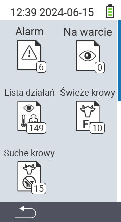

{}
Jeśli klikniesz element menu, zostaniesz przekierowany do opisu odpowiedniej funkcji.
{}

<map name="workmap">
  <area shape="rect" coords="3,40,116,160" alt="Lista alarmów" title="Sprawdź swoją listę alarmów&#10;Kliknięcie myszą: otwórz dokumentację" href="/pl/docs/lists/alarm/">
  <area shape="rect" coords="3,160,116,280" alt="Lista działań" title="Sprawdź swoją listę działań&#10;Kliknięcie myszą: otwórz dokumentację" href="/pl/docs/lists/actions/">
  <area shape="rect" coords="3,280,116,399" alt="Lista suchych krów" title="Sprawdź swoją listę suchych krów&#10;Kliknięcie myszą: otwórz dokumentację" href="/pl/docs/lists/dry-cows/">

  <area shape="rect" coords="116,40,230,160" alt="Lista do obserwacji" title="Sprawdź swoją listę do obserwacji&#10;Kliknięcie myszą: otwórz dokumentację" href="/pl/docs/lists/on-watch/">
  <area shape="rect" coords="116,160,230,280" alt="Świeże krowy" title="Sprawdź swoją listę świeżych krów&#10;Kliknięcie myszą: otwórz dokumentację" href="/pl/docs/lists/fresh-cows/">

  <area shape="rect" coords="2,401,115,438" alt="Wstecz" title="Cofnij się o jeden poziom" href="/pl/docs/menu/mainmenu/">
</map>
