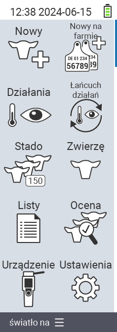

{}
Jeśli klikniesz element menu, zostaniesz przekierowany do opisu odpowiedniej funkcji.
{}

<map name="workmap">
  <area shape="rect" coords="3,40,116,160" alt="Nowy" title="Utwórz nowe zwierzęta&#10;Kliknięcie myszą: otwórz dokumentację" href="/pl/docs/new/">
  <area shape="rect" coords="3,160,116,280" alt="Akcje" title="Akcje na zwierzętach&#10;Kliknięcie myszą: otwórz dokumentację" href="/pl/docs/actions/">
  <area shape="rect" coords="3,280,116,400" alt="Stado" title="Menu stada&#10;Kliknięcie myszą: otwórz dokumentację" href="/pl/docs/herd/">
  <area shape="rect" coords="3,400,116,520" alt="Listy" title="Listy zwierząt&#10;Kliknięcie myszą: otwórz dokumentację" href="/pl/docs/lists/">
  <area shape="rect" coords="3,520,116,634" alt="Urządzenie" title="Urządzenie&#10;Kliknięcie myszą: otwórz dokumentację" href="/pl/docs/device/">

  <area shape="rect" coords="116,40,230,160" alt="Nowy na farmie" title="Dostęp zwierząt&#10;Kliknięcie myszą: otwórz dokumentację" href="/pl/docs/new-on-farm/">
  <area shape="rect" coords="116,160,230,280" alt="Łańcuch akcji" title="Łańcuch akcji&#10;Kliknięcie myszą: otwórz dokumentację" href="/pl/docs/chain-of-actions/">
  <area shape="rect" coords="116,280,230,400" alt="Zwierzę" title="Zwierzę&#10;Kliknięcie myszą: otwórz dokumentację" href="/pl/docs/animal/">
  <area shape="rect" coords="116,400,230,520" alt="Ocena" title="Ocena&#10;Kliknięcie myszą: otwórz dokumentację" href="/pl/docs/evaluation/">
  <area shape="rect" coords="116,520,230,634" alt="Ustawienia" title="Ustawienia&#10;Kliknięcie myszą: otwórz dokumentację" href="/pl/docs/settings/">
</map>
