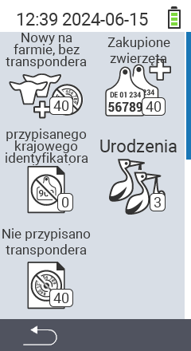

{}
Jeśli klikniesz element menu, zostaniesz przekierowany do opisu odpowiedniej funkcji.
{}

<map name="workmap">
  <area shape="rect" coords="3,40,116,160" alt="Nowe na farmie, bez transpondera" title="Tutaj przypisujesz transponder nowym zwierzętom bez transpondera&#10;Kliknięcie myszą: otwórz dokumentację" href="/pl/docs/new-on-farm/new-no-transponder/">
  <area shape="rect" coords="3,160,116,280" alt="Brak przypisanego krajowego ID zwierzęcia" title="Tutaj możesz zobaczyć wszystkie zwierzęta, którym nie przypisano jeszcze krajowego ID zwierzęcia i przypisać krajowe ID zwierzęcia&#10;Kliknięcie myszą: otwórz dokumentację" href="/pl/docs/new-on-farm/no-national-animal-id-assigned/">
  <area shape="rect" coords="3,280,116,399" alt="Brak przypisanego transpondera" title="Tutaj możesz zobaczyć wszystkie zwierzęta, którym nie przypisano jeszcze transpondera i przypisać im transponder&#10;Kliknięcie myszą: otwórz dokumentację" href="/pl/docs/new-on-farm/no-transponder-assigned/">

  <area shape="rect" coords="116,40,230,160" alt="Zakupione zwierzęta" title="Tutaj możesz zobaczyć swoje bieżące zakupy i wyeksportować dane&#10;Kliknięcie myszą: otwórz dokumentację" href="/pl/docs/new-on-farm/purchased-animals/">
  <area shape="rect" coords="116,160,230,280" alt="Narodziny" title="Tutaj możesz zobaczyć swoje narodziny i utworzyć plik eksportu&#10;Kliknięcie myszą: otwórz dokumentację" href="/pl/docs/new-on-farm/births/">
  <area shape="rect" coords="1,401,100,439" alt="Wstecz" title="Przejdź o jeden poziom wstecz&#10;Kliknięcie myszą: do dokumentacji" href="/pl/docs/menu/mainmenu/">
</map>
