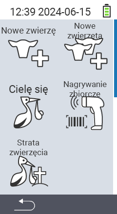

Poprzez główną pozycję menu  `` przechodzisz do podmenu, gdzie do wyboru jest 5 podpozycji:

<map name="workmap">
  <area shape="rect" coords="3,40,116,160" alt="Nowe zwierzę" title="Jak zarejestrować nowe zwierzę za pomocą urządzenia VitalControl&#10;Kliknięcie myszą: otwórz dokumentację" href="/en/docs/new/animal/">
  <area shape="rect" coords="3,160,116,280" alt="Wycielenie" title="Jak zarejestrować nowe wycielenie za pomocą urządzenia VitalControl&#10;Kliknięcie myszą: otwórz dokumentację" href="/en/docs/new/calving/">
  <area shape="rect" coords="3,280,116,399" alt="Utrata zwierzęcia" title="Jak zarejestrować utratę zwierzęcia za pomocą urządzenia VitalControl&#10;Kliknięcie myszą: otwórz dokumentację" href="/en/docs/new/animal-loss/">

  <area shape="rect" coords="116,40,230,160" alt="Nowe zwierzęta" title="Jak utworzyć wiele nowych zwierząt na urządzeniu VitalControl za pomocą jednej akcji&#10;Kliknięcie myszą: otwórz dokumentację" href="/en/docs/new/animals/">
  <area shape="rect" coords="116,160,230,280" alt="Rejestracja zbiorcza" title="Użyj skanera kodów kreskowych, aby zarejestrować różne zwierzęta&#10;Kliknięcie myszą: otwórz dokumentację" href="/en/docs/new/bulk-recording/">

  <area shape="rect" coords="1,401,100,439" alt="Wstecz" title="Cofnij się o jeden poziom&#10;Kliknięcie myszą: do dokumentacji" href="/en/docs/menu/mainmenu/">
</map>

{}
Każde podmenu ma swoją własną ikonę. Przesuń wskaźnik myszy nad ikonę w powyższej grafice i pozostaw go na chwilę. Pojawi się podpowiedź, pokazująca informacje o wybranym podmenu. Jeśli klikniesz jedną z ikon, zostaniesz przekierowany do opisu wybranej podpozycji menu.
{}

