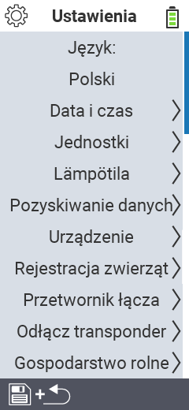

{}
Jeśli klikniesz element menu, zostaniesz przekierowany do opisu odpowiedniej funkcji.
{}

<map name="workmap">
  <area shape="rect" coords="2,40,230,120" alt="Język" title="Ustaw i trwale zapisz język interfejsu użytkownika na swoim urządzeniu VitalControl&#10;Kliknięcie myszą: otwórz dokumentację" href="/pl/docs/settings/language/">
  <area shape="rect" coords="2,120,230,160" alt="Data i czas" title="Tutaj ustawiasz datę i czas&#10;Kliknięcie myszą: otwórz dokumentację" href="/pl/docs/settings/datetime/">
  <area shape="rect" coords="2,160,230,200" alt="Jednostki" title="Tutaj wybierasz jednostki dla temperatury i masy&#10;Kliknięcie myszą: otwórz dokumentację" href="/pl/docs/settings/units/">
  <area shape="rect" coords="2,200,230,240" alt="Temperatura" title="Ustawienia temperatury dla aplikacji Twojego urządzenia VitalControl&#10;Kliknięcie myszą: otwórz dokumentację" href="/pl/docs/settings/temperature/">
   <area shape="rect" coords="2,240,230,280" alt="Pozyskiwanie danych" title="Tutaj zapisujesz istotne informacje dotyczące zbierania danych o zwierzętach&#10;Kliknięcie myszą: otwórz dokumentację" href="/pl/docs/settings/data-acquisition/">
   <area shape="rect" coords="2,280,230,320" alt="Urządzenie" title="Tutaj możesz dostosować różne ustawienia urządzenia&#10;Mausklick: zur Dokumentation" href="/pl/docs/settings/device/">
   <area shape="rect" coords="2,320,230,360" alt="Rejestracja zwierząt" title="Tutaj możesz dostosować kilka fabrycznych standardów dotyczących rejestracji nowych zwierząt do wymagań Twojego gospodarstwa.&#10;Kliknięcie myszą: otwórz dokumentację" href="/pl/docs/settings/animal-registration/">
   <area shape="rect" coords="2,360,230,400" alt="Powiązanie transpondera" title="Ustaw przypisanie transpondera na swoim urządzeniu VitalControl&#10;Kliknięcie myszą: otwórz dokumentację" href="/pl/docs/settings/transponder-linkage/">
   <area shape="rect" coords="2,400,230,439" alt="Odłączenie transpondera" title="Określ, jak identyfikator zwierzęcia będzie przypisany po odłączeniu transpondera&#10;Kliknięcie myszą: otwórz dokumentację" href="/pl/docs/settings/transponder-linkage/">
   <area shape="rect" coords="2,440,230,480" alt="Gospodarstwo" title="Trwale zapisz swój oficjalny dwunastocyfrowy krajowy identyfikator gospodarstwa na urządzeniu VitalControl&#10;Kliknięcie myszą: otwórz dokumentację" href="/pl/docs/settings/farm-number/">
   <area shape="rect" coords="2,482,123,519" alt="Wstecz" title="Wróć o jeden poziom" href="/pl/docs/menu/mainmenu/">
</map>

