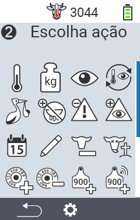
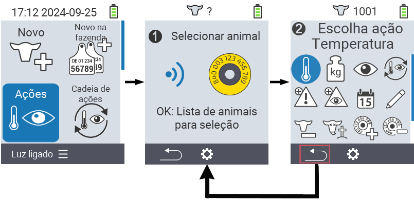
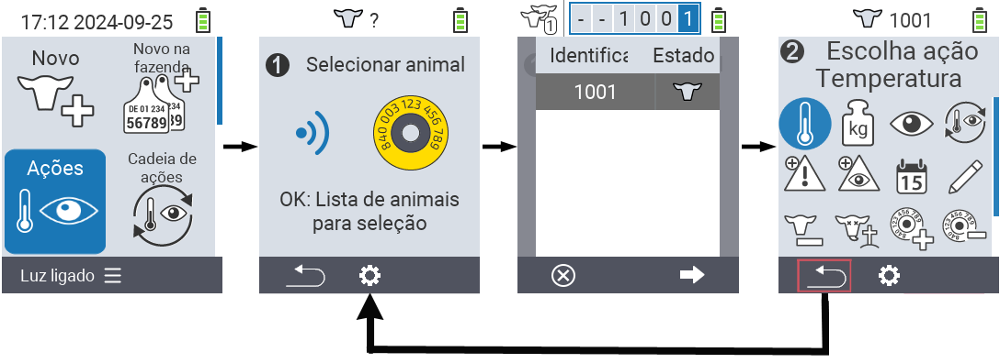

## Ações disponíveis {#available-actions}

Dependendo do tipo de animal, você pode realizar até 16 ações diferentes para um animal.

<map name="workmap">
  <area shape="rect" coords="3,100,60,165" alt="Temperatura" title="Medir febre nos seus animais&#10;Clique do mouse: abrir documentação" href="/pt/docs/actions/measure-temperature/">
  <area shape="rect" coords="60,100,118,165" alt="Pesagem" title="Registrar o peso dos seus animais&#10;Clique do mouse: abrir documentação" href="/pt/docs/actions/record-weight/">
  <area shape="rect" coords="118,100,174,165" alt="Avaliação" title="Avaliar seus animais&#10;Clique do mouse: abrir documentação" href="/pt/docs/actions/rating/">
  <area shape="rect" coords="174,100,230,165" alt="Cadeia de ações" title="Aplicar e configurar a cadeia de ações&#10;Clique do mouse: abrir documentação" href="/pt/docs/chain-of-actions/">
   <area shape="rect" coords="3,165,60,225" alt="Parto" title="Registrar um parto&#10;Clique do mouse: abrir documentação" href="/pt/docs/actions/calving/">
   <area shape="rect" coords="60,165,120,225" alt="Secagem" title="Secar uma vaca ou adicioná-la à lista de vacas frescas&#10;Clique do mouse: abrir documentação" href="/pt/docs/actions/dry-off/">
   <area shape="rect" coords="120,165,175,225" alt="Alarme" title="Adicionar e remover animais da lista de alarme&#10;Clique do mouse: abrir documentação" href="/pt/docs/actions/alarm/">
   <area shape="rect" coords="175,165,230,225" alt="Em observação" title="Colocar animais na lista de observação ou removê-los&#10;Clique do mouse: abrir documentação" href="/pt/docs/actions/on-watch/">
   <area shape="rect" coords="3,225,60,280" alt="Histórico do animal" title="Ver o histórico de um animal&#10;Clique do mouse: abrir documentação" href="/pt/docs/actions/animal-history/">
   <area shape="rect" coords="60,225,120,280" alt="Editar" title="Editar dados do animal selecionado&#10;Clique do mouse: abrir documentação" href="/pt/docs/actions/edit/">
   <area shape="rect" coords="120,225,175,280" alt="Desregistrar" title="Desregistrar um animal&#10;Clique do mouse: abrir documentação" href="/pt/docs/actions/unregister/">
   <area shape="rect" coords="175,225,230,280" alt="Perda de animal" title="Registrar uma perda de animal&#10;Clique do mouse: abrir documentação" href="/pt/docs/actions/animal-loss/">
   <area shape="rect" coords="3,280,60,337" alt="Vincular transponder" title="Atribuir um transponder a um animal&#10;Clique do mouse: abrir documentação" href="/pt/docs/actions/link-transponder/">
   <area shape="rect" coords="55,280,120,337" alt="Desvincular transponder" title="Remover o vínculo do transponder com um animal&#10;Clique do mouse: abrir documentação" href="/pt/docs/actions/unlink-transponder/">
   <area shape="rect" coords="120,280,175,337" alt="Vincular ID do animal manualmente" title="Atribuir um ID nacional de animal a um animal que não possui um ID nacional de animal&#10;Clique do mouse: abrir documentação" href="/pt/docs/actions/link-animal-id/#link-animal-id">
   <area shape="rect" coords="175,280,230,337" alt="Vincular ID do animal com escaneamento" title="Atribuir um ID nacional de animal a um animal que não possui um ID nacional de animal&#10;Clique do mouse: abrir documentação" href="/pt/docs/actions/link-animal-id/#link-animal-id-with-electronic-ear-tag-scan">

   <area shape="rect" coords="100,340,140,375" alt="Configurações" title="Chamar as configurações&#10;Clique do mouse: para a documentação" href="/pt/docs/actions/setting/">
</map>

{}
Cada ação é identificada por um símbolo. Mova o ponteiro do mouse sobre um símbolo no gráfico abaixo e deixe-o descansar por um momento. Um tooltip aparecerá, apresentando informações sobre a respectiva ação. Se você clicar em um dos símbolos, será encaminhado para uma descrição da respectiva ação.
{}

## Procedimento geral {#general-procedure}

Dentro do menu  `` você pode selecionar o próximo animal a qualquer momento sem ter que sair do item de menu Ações. Para selecionar o próximo animal, proceda da seguinte forma:

1. Selecione o item de menu  `` na tela principal do seu dispositivo VitalControl e pressione o botão ``.

2. Ou escaneie um animal usando o transponder ou selecione um animal da lista. Confirme pressionando `` e selecione um animal usando os botões de seta △ ▽. Confirme com ``.

3. Um submenu será aberto no qual você encontrará ícones para várias ações de animais. Use os botões de seta para selecionar a ação desejada e inicie a ação pressionando o botão ``. Dependendo da ação selecionada, uma ou mais telas ou uma janela pop-up aparecerão.

4. Se desejar, você pode agora selecionar e executar outra ação para o animal atual.

5. Depois de realizar a(s) ação(ões) desejada(s) para o animal, volte ao passo 2 'Seleção de animal'. Para fazer isso, pressione o botão esquerdo `F1` abaixo do símbolo `` no canto inferior esquerdo do rodapé.

6. A janela do passo dois será aberta novamente automaticamente e você pode selecionar o próximo animal ou retornar ao menu principal pressionando o botão `F1` abaixo do símbolo ``.



{}

{}
{}

{}


