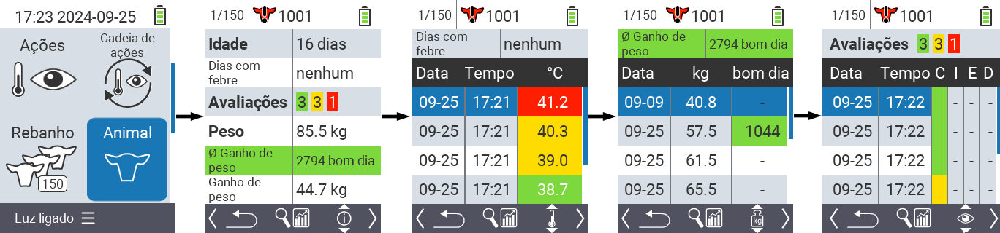
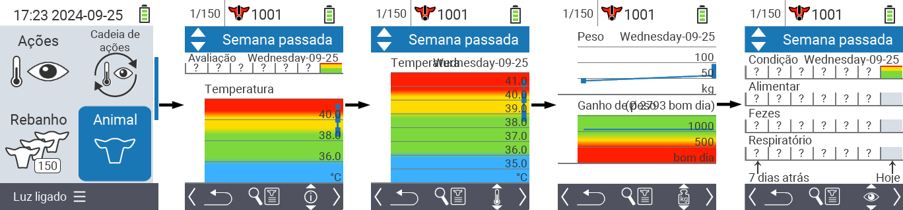
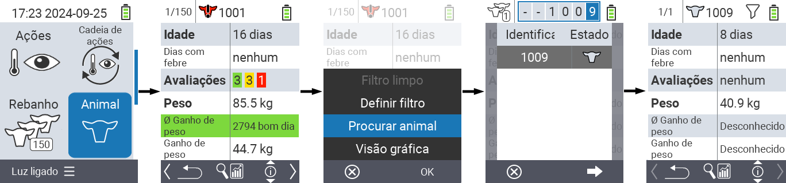
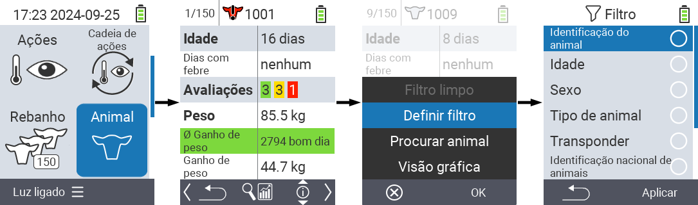

## Animal {#animal}

A função de animal individual permite visualizar informações importantes sobre peso, temperatura e classificação de cada animal individual. Você sempre tem a opção de exibir as informações como um gráfico ou como uma lista. Para usar a função de animal individual, proceda da seguinte forma:

1. Na tela principal do seu dispositivo VitalControl, selecione o item do menu  `` e pressione o botão ``.

2. Uma visão geral das informações mais importantes do animal será aberta. A borda superior da tela mostra qual animal você está visualizando no momento. Use a tecla `F3` para escolher entre informações do animal , temperatura , peso  e classificação .

{}
Dentro de cada exibição de informações, você tem a opção de [procurar um animal](#search-animal), definir um [filtro](#set-filter) e alternar para uma [visualização gráfica](#set-graphical-view).
Você também pode alternar entre os animais individuais a qualquer momento usando as teclas de seta ◁ ▷.
{}

### Definir visualização gráfica {#set-graphical-view}

1. Pressione o botão superior do meio `On/Off`  para abrir um menu pop-up. Neste menu, você pode escolher entre as funções ``, `` ou ``.

2. Selecione `` com as teclas de seta △ ▽ e confirme com ``.

### Buscar animal {#search-animal}

1. Pressione o botão superior do meio `On/Off`  para abrir um menu pop-up. Neste menu, você pode escolher entre as funções ``, `` ou ``.

2. Selecione `` com as teclas de seta △ ▽ e confirme com ``.

3. Use as teclas de seta △ ▽ ◁ ▷ para selecionar o número do animal desejado e confirme com ``

### Definir filtro {#set-filter}

1. Pressione o botão superior do meio `On/Off`  para abrir um menu pop-up. Neste menu, você pode escolher entre as funções ``, `` ou ``.

2. Selecione `` com as teclas de seta △ ▽ e confirme com ``.
Você pode obter instruções sobre como usar o filtro [aqui]().

