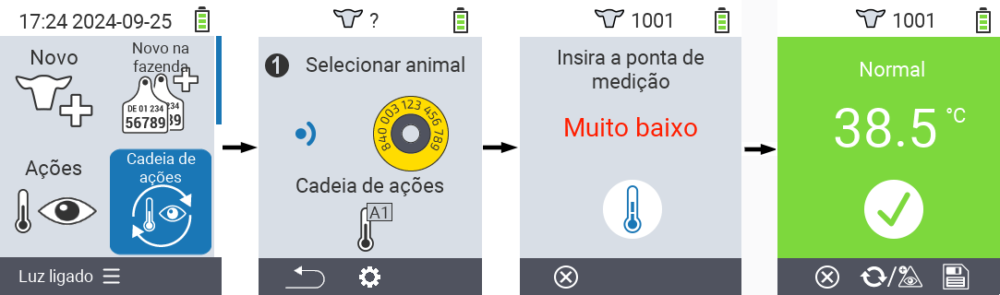
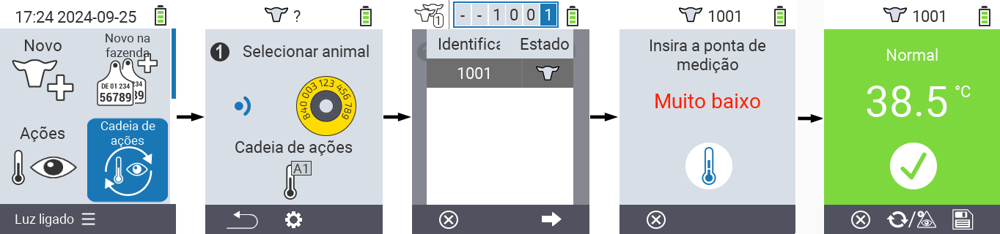
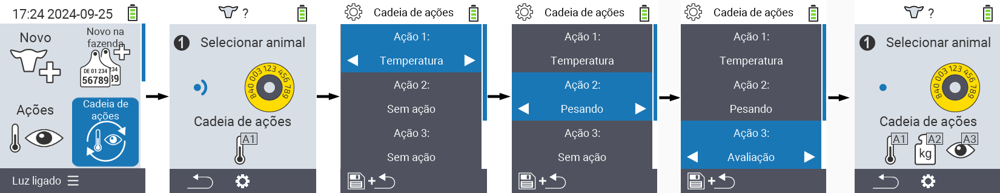

## Cadeia de ações {#chain-of-actions}

A cadeia de ações permite que você realize automaticamente várias ações para um animal uma após a outra. Por exemplo, você pode selecionar as ações `` e ``. Se você então realizar a cadeia de ações, você pode medir a temperatura do seu animal primeiro e registrar a avaliação imediatamente depois.

### Usar cadeia de ações {#use-chain-of-actions}

1. Na tela principal do seu dispositivo VitalControl, selecione o item do menu &nbsp;&nbsp; `` e pressione o botão ``.

2. Ou escaneie um animal usando o transponder ou confirme com `` e use as teclas de seta △ ▽ ◁ ▷ para inserir o ID do animal desejado.

3. A cadeia de ações agora é executada. Assim que todas as ações na cadeia de ações forem realizadas, o próximo animal pode ser selecionado diretamente.



{}

{}
{}

{}


### Configurar cadeia de ações {#set-chain-of-actions}

1. Na tela principal do seu dispositivo VitalControl, selecione o item do menu &nbsp;&nbsp; `` e pressione o botão ``.

2. Use o botão `F2` &nbsp;&nbsp; (``).

3. Uma tela de sobreposição aparece. Use as teclas de seta △ ▽ para escolher entre as ações listadas de 1 a 4 (você pode realizar até quatro ações consecutivas). Use as teclas de seta ◁ ▷ para selecionar a ação desejada para a respectiva ação. Salve as configurações com a tecla `F1` &nbsp;&nbsp;.

4. Se você quiser redefinir toda a cadeia de ações, selecione a opção `` no submenu usando as teclas de seta △ ▽ e confirme com ``.

    

{}
Dentro das ações individuais, você tem as mesmas opções de configuração descritas no capítulo [Ações](../actions) para cada ação individual.
{}

{}
Os símbolos na tela inicial da cadeia de ações mostram quais ações você configurou e em que ordem.
{}
