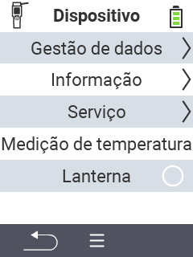

{}
Se você clicar em um item do menu, será redirecionado para uma descrição da respectiva função.
{}

<map name="workmap">
  <area shape="rect" coords="2,40,238,80" alt="Gerenciamento de dados" title="Execute backups de dados, exporte seus dados e redefina o dispositivo&#10;Clique do mouse: abrir documentação" href="/pt/docs/device/data-management/">
  <area shape="rect" coords="2,80,238,120" alt="Informações" title="Veja informações importantes de software e hardware&#10;Clique do mouse: abrir documentação" href="/pt/docs/device/info/">
  <area shape="rect" coords="2,120,238,160" alt="Serviço" title="Verifique os drivers do seu dispositivo, atualize seu firmware e realize um teste de alcance&#10;Clique do mouse: abrir documentação" href="/pt/docs/device/service/">
  <area shape="rect" coords="2,160,238,200" alt="Medição de temperatura" title="Teste a medição de temperatura do seu dispositivo&#10;Clique do mouse: abrir documentação" href="/pt/docs/device/temperature-measurement/">
  <area shape="rect" coords="2,200,238,240" alt="Lanterna" title="Ligue ou desligue a luz do seu dispositivo VitalControl&#10;Clique do mouse: abrir documentação" href="/pt/docs/device/flashlight/">

  <area shape="rect" coords="2,282,97,318" alt="Voltar" title="Voltar um nível" href="/pt/docs/menu/mainmenu/">
</map>
