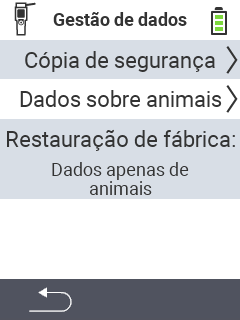

{}
Se você clicar em um item do menu, será redirecionado para uma descrição da respectiva função.
{}

<map name="workmap">
  <area shape="rect" coords="2,40,238,80" alt="Backup de dados" title="As instruções para criar um backup podem ser encontradas aqui&#10;Clique com o mouse: abrir documentação" href="/pt/docs/device/data-management/data-backup/">

  <area shape="rect" coords="2,80,238,120" alt="Dados do animal" title="As instruções para restaurar um backup podem ser encontradas aqui&#10;Clique com o mouse: abrir documentação" href="/pt/docs/device/data-management/animal-data/">

  <area shape="rect" coords="2,120,238,200" alt="Redefinição de fábrica" title="Todas as informações e instruções para redefinir o dispositivo e os dados do animal podem ser encontradas aqui&#10;Clique com o mouse: abrir documentação" href="/pt/docs/reset/">

  <area shape="rect" coords="2,282,120,319" alt="Voltar" title="Todas as informações e instruções para exportar dados de animais podem ser encontradas aqui&#10;Clique com o mouse: abrir documentação" href="/pt/docs/device/">
</map>
