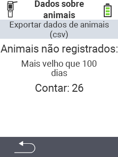

<map name="workmap">
  <area shape="rect" coords="2,40,238,80" alt="Export animal data (csv)" title="Exporte seus dados de animais&#10;Clique com o mouse: abrir documentação" href="/pt/docs/data-export/usb-drive/">

  <area shape="rect" coords="2,80,238,200" alt="Unregister animals" title="Especifique a idade a partir da qual os animais devem ser desregistrados&#10;Clique com o mouse: abrir documentação" href="/pt/docs/device/data-management/animal-data/unregister-animal/">

  <area shape="rect" coords="2,282,120,319" alt="Back" title="Todas as informações e instruções para exportar dados de animais podem ser encontradas aqui&#10;Clique com o mouse: abrir documentação" href="/pt/docs/device/data-management/">
</map>
