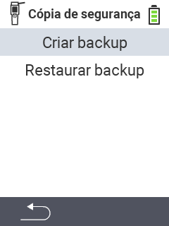

<map name="workmap">
  <area shape="rect" coords="2,40,238,80" alt="Criar backup" title="As instruções para criar um backup podem ser encontradas aqui&#10;Clique do mouse: abrir documentação" href="/pt/docs/backup/backup/">

  <area shape="rect" coords="2,80,238,120" alt="Restaurar backup" title="As instruções para restaurar um backup podem ser encontradas aqui&#10;Clique do mouse: abrir documentação" href="/pt/docs/backup/restore/">

  <area shape="rect" coords="2,282,120,319" alt="Voltar" title="Voltar um nível&#10;Clique do mouse: abrir documentação" href="/pt/docs/device/data-management/">
</map>
