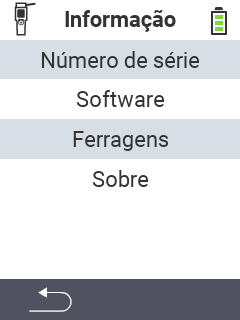

{}
Se você clicar em um item do menu, será redirecionado para uma descrição da respectiva função.
{}

<map name="workmap">
  <area shape="rect" coords="2,40,238,80" alt="Serial number" title="Para recuperar o número de série do seu dispositivo clique aqui&#10;Mausklick: zur Dokumentation" href="/pt/docs/device/info/serial-number/">
  <area shape="rect" coords="2,80,238,120" alt="Software" title="As instruções para visualizar a versão do seu software podem ser encontradas aqui&#10;Mausklick: zur Dokumentation" href="/pt/docs/firmware/versions/">
  <area shape="rect" coords="2,120,238,160" alt="Hardware" title="Para acessar as informações de hardware do seu dispositivo clique aqui&#10;Mausklick: zur Dokumentation" href="/pt/docs/device/info/hardware/">
  <area shape="rect" coords="2,160,238,200" alt="About" title="Chamar informações do fornecedor&#10;Mausklick: zur Dokumentation" href="/pt/docs/device/info/about/">

  <area shape="rect" coords="2,282,120,319" alt="Back" title="Voltar ao nível anterior&#10;Mouse click: abrir documentação" href="/pt/docs/device/">
</map>
