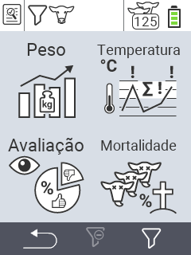

{}
Se você clicar em um item do menu, será redirecionado para uma descrição da respectiva função.
{}

<map name="workmap">
  <area shape="rect" coords="3,40,116,160" alt="Peso" title="Avalie seus dados armazenados na seção Peso&#10;Clique do mouse: abrir documentação" href="/pt/docs/evaluation/weight/">
  <area shape="rect" coords="3,160,116,279" alt="Classificação" title="Avalie seus dados armazenados na seção de classificação&#10;Clique do mouse: abrir documentação" href="/pt/docs/evaluation/rating/">

  <area shape="rect" coords="116,40,238,160" alt="Temperatura" title="Avalie seus dados armazenados na seção Temperatura&#10;Clique do mouse: abrir documentação" href="/pt/docs/evaluation/temperature/">
  <area shape="rect" coords="116,160,238,279" alt="Mortalidade" title="Avalie seus dados armazenados na seção de mortalidade&#10;Clique do mouse: abrir documentação" href="/pt/docs/evaluation/mortality/">

  <area shape="rect" coords="150,282,238,319" alt="Filtro" title="Defina um filtro&#10;Clique do mouse: para a documentação" href="/pt/docs/filter">
  <area shape="rect" coords="2,282,95,319" alt="Voltar" title="Voltar um nível&#10;Clique do mouse: para a documentação" href="/pt/docs/menu/mainmenu/">
</map>
