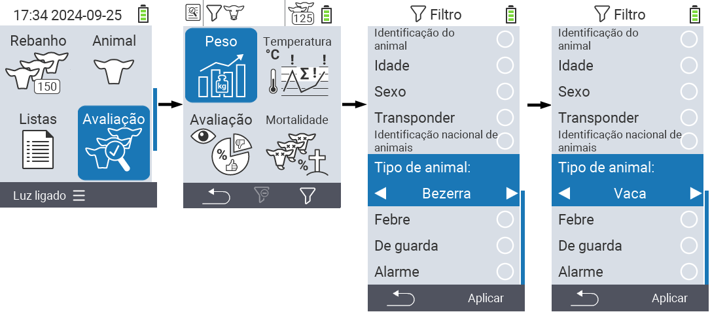
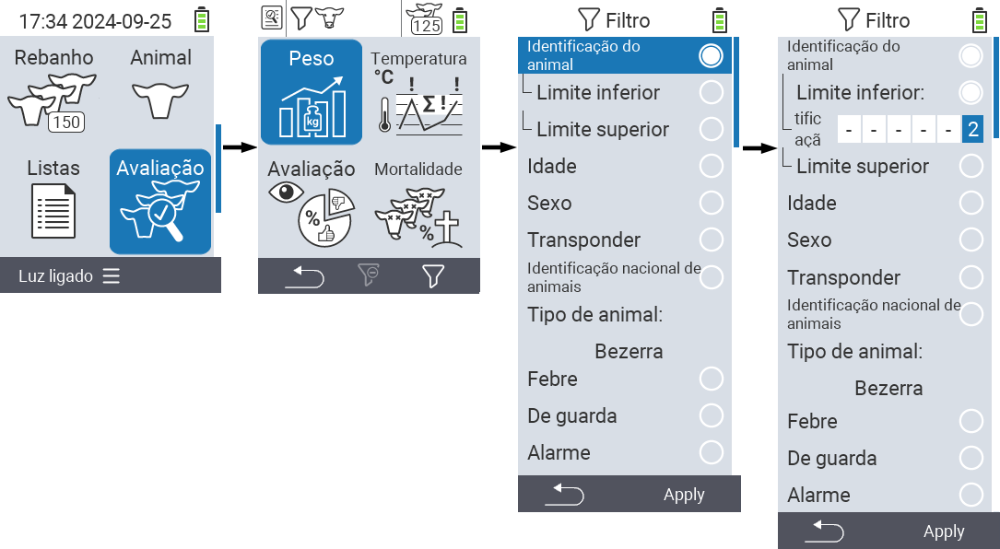
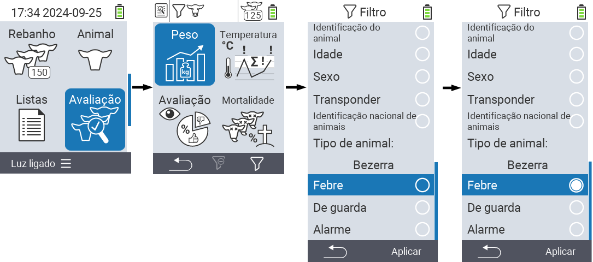

## Aplicando filtros {#applying-filters}

{}
O filtro ajuda você a realizar uma seleção usando critérios de filtro dentro dos itens do menu ``, `` e `` do dispositivo VitalControl. Assim que você aplica um filtro, símbolos para os vários critérios de filtro aparecem na parte superior da tela. Esses símbolos são usados para ajudar você a descobrir se e quais critérios de filtro estão ativados. Por exemplo, se você definir o filtro `` para macho, o dispositivo usará apenas animais machos. Por exemplo, se você também ativar o filtro ``, o dispositivo usará apenas animais machos que estão na lista de observação.
{}

Para criar um filtro nas avaliações, proceda da seguinte forma:

1. No submenu pertencente ao item de menu superior  `` pressione a tecla `F3`  uma vez. Dentro do submenu pertencente aos itens de menu superior  `` e  ``, você deve pressionar a tecla duas vezes.

2. Um submenu é aberto no qual você pode definir todas as opções de filtro. Você pode filtrar por ``, ``, ``, ``, ``, ``, ``, `` e ``.

3. Para os filtros ``, ``, `` e `` navegue até a área correspondente e confirme com ``. Use as teclas de seta ◁ ▷ para especificar a configuração desejada. Use a tecla `F3` `` para colocar a configuração selecionada em prática. Para descartar suas alterações de filtro, pressione a tecla `F1` &nbsp;&nbsp;.

4. Para os filtros `` e ``, selecione o critério correspondente e confirme com ``. Agora será mostrado um limite inferior e superior. Navegue até o limite desejado usando as teclas de seta △ ▽ e confirme pressionando `` duas vezes. Agora você pode definir o número desejado usando as teclas de seta ◁ ▷ e as teclas de seta △ ▽. Uma vez que todas as configurações estejam corretas, pressione `` novamente para sair do modo de configuração e aplique o(s) filtro(s) selecionado(s) com a tecla `F3` ``. Usando a tecla `F1` &nbsp;&nbsp;, você pode descartar suas alterações, se desejar.

5. Para os filtros ``, `` e ``, há a possibilidade de desativar ou ativar sua aplicação. Para fazer isso, selecione o filtro correspondente e confirme com ``. O filtro agora está ativo. Confirme novamente com `` para desativar o filtro.

6. Depois de definir todos os filtros, use a tecla `F3` `` para colocar os filtros definidos em prática ou pressione a tecla `F1`  para descartar suas alterações nos filtros.
