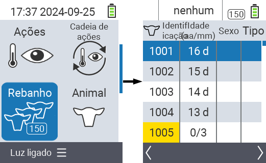
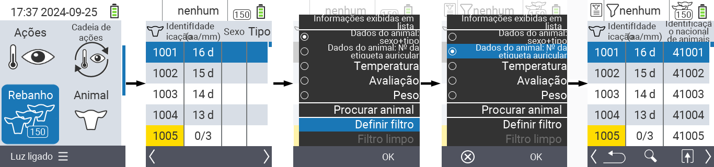
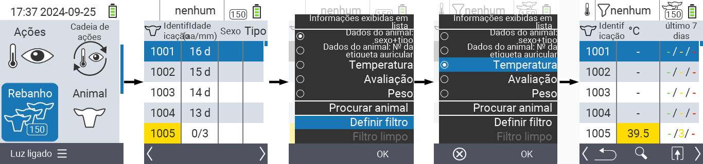
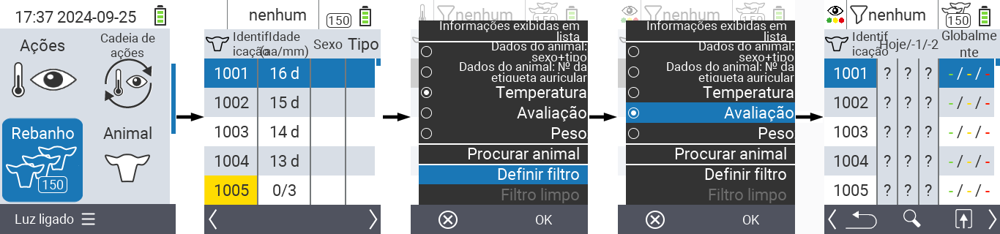
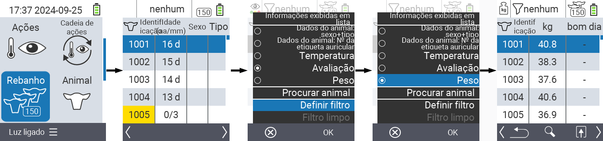
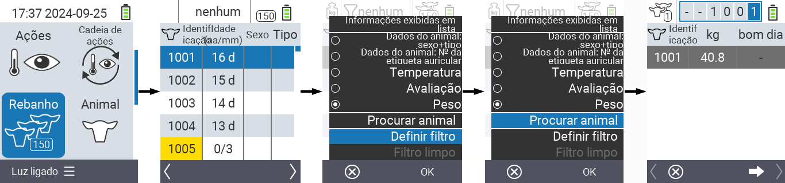
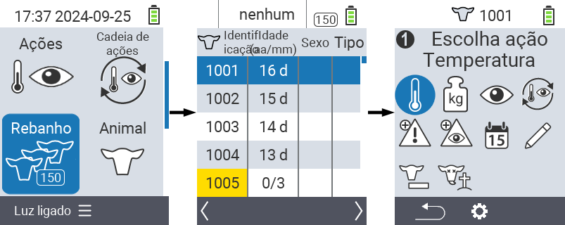

## Rebanho {#herd}

No item de menu Rebanho, você pode visualizar todo o seu rebanho, procurar animais individuais e exibir informações importantes. Você tem as seguintes possibilidades:

- Ver [dados do animal](#view-animal-data)
- Ver [dados de temperatura](#display-temperature)
- Ver [dados de avaliação](#view-rating)
- Ver [dados de peso](#view-rating)
- [Procurar animal](#search-animal)
- Definir [filtro](#set-filter)
- [Ações](#call-action-menu)

### Etapas preparatórias {#preparatory-steps}

1. Na tela principal do seu dispositivo VitalControl, selecione o item de menu  `` e pressione o botão ``.

2. A visão geral do seu rebanho será aberta.

    

### Ver dados do animal {#view-animal-data}

1. Complete as etapas preparatórias.

2. Use a tecla `F3` &nbsp;&nbsp; para invocar um menu popup que lista as categorias de informações que podem ser exibidas na lista do rebanho. Use as teclas de seta △ ▽ para destacar a linha `` ou `` e selecione esta categoria pressionando o botão central `` ou a tecla `F3` ``. As duas opções de seleção diferem na exibição da barra de informações.

3. Os dados do animal serão agora exibidos como conteúdo da lista do rebanho.

4. Alternativamente, você pode usar as teclas de seta ◁ ▷ para alternar entre as diferentes opções de exibição.

    

{}
Por padrão, os dados do animal são exibidos primeiro. Somente quando você tiver o peso exibido, por exemplo, você precisará definir novamente a exibição dos dados do animal.
{}

### Exibir temperatura {#display-temperature}

1. Complete os passos preparatórios.

2. Use a tecla `F3` &nbsp;&nbsp; para invocar um menu popup que lista as categorias de informações que podem ser exibidas para a lista do rebanho. Use as teclas de seta △ ▽ para destacar a linha `` e selecione esta categoria pressionando o botão central `` ou a tecla `F3` ``.

3. Os dados de temperatura agora serão exibidos como conteúdo da lista do rebanho.

4. Alternativamente, você pode usar as teclas de seta ◁ ▷ para alternar entre as diferentes opções de exibição.

    

### Ver classificação {#view-rating}

1. Complete os passos preparatórios.

2. Use a tecla `F3` &nbsp;&nbsp; para invocar um menu popup que lista as categorias de informações que podem ser exibidas para a lista do rebanho. Use as teclas de seta △ ▽ para destacar a linha `` e selecione esta categoria pressionando o botão central `` ou a tecla `F3` ``.

3. Os dados de classificação agora serão exibidos como conteúdo da lista do rebanho.

4. Alternativamente, você pode usar as teclas de seta ◁ ▷ para alternar entre as diferentes opções de exibição.

    

### Exibir peso {#display-weight}

1. Complete os passos preparatórios.

2. Use a tecla `F3` &nbsp;&nbsp; para invocar um menu popup que lista as categorias de informações que podem ser exibidas para a lista do rebanho. Use as teclas de seta △ ▽ para destacar a linha `` e selecione esta categoria pressionando o botão central `` ou a tecla `F3` ``.

3. Os dados de peso agora serão exibidos como conteúdo da lista do rebanho.

4. Alternativamente, você pode usar as teclas de seta ◁ ▷ para alternar entre as diferentes opções de exibição.

### Procurar animal {#search-animal}

1. Complete os passos preparatórios.

2. Use a tecla `F3` &nbsp;&nbsp; para invocar um menu popup que lista várias opções. Use as teclas de seta △ ▽ para destacar a função `` e invoque a função de busca pressionando a tecla central `` ou a tecla `F3` ``. Alternativamente, você pode usar o botão `On/Off`  imediatamente após o primeiro passo.

3. Use as teclas de seta △ ▽ ◁ ▷ para inserir o número do animal desejado e confirme com ``.

### Definir filtro {#set-filter}

1. Complete os passos preparatórios.

2. Use a tecla `F3` &nbsp;&nbsp; para invocar um menu popup que lista várias opções. Use as teclas de seta △ ▽ para destacar a função `` e invoque a função de filtro pressionando a tecla central `` ou a tecla `F3` ``.

3. Como aplicar o filtro pode ser encontrado [aqui]().

### Chamar menu de ações {#call-action-menu}

Você sempre tem a opção de chamar o menu de ações para um animal.

1. Complete os passos preparatórios.

2. Selecione um animal da lista com as teclas de seta △ ▽ e confirme com ``.

3. O menu de ações está agora aberto. Como usar isso pode ser encontrado [aqui](../actions).

4. Retorne à lista do rebanho com a tecla `F3`.

