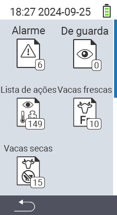

{}
Se você clicar em um item do menu, será redirecionado para uma descrição da respectiva função.
{}

<map name="workmap">
  <area shape="rect" coords="3,40,116,160" alt="Lista de alarmes" title="Confira sua lista de alarmes&#10;Clique do mouse: abrir documentação" href="/pt/docs/lists/alarm/">
  <area shape="rect" coords="3,160,116,280" alt="Lista de ações" title="Confira sua lista de ações&#10;Clique do mouse: abrir documentação" href="/pt/docs/lists/actions/">
  <area shape="rect" coords="3,280,116,399" alt="Lista de vacas secas" title="Confira sua lista de vacas secas&#10;Clique do mouse: abrir documentação" href="/pt/docs/lists/dry-cows/">

  <area shape="rect" coords="116,40,230,160" alt="Lista de observação" title="Confira sua lista de observação&#10;Clique do mouse: abrir documentação" href="/pt/docs/lists/on-watch/">
  <area shape="rect" coords="116,160,230,280" alt="Vacas frescas" title="Confira sua lista de vacas frescas&#10;Clique do mouse: abrir documentação" href="/pt/docs/lists/fresh-cows/">

  <area shape="rect" coords="2,401,115,438" alt="Voltar" title="Voltar um nível" href="/pt/docs/menu/mainmenu/">
</map>
