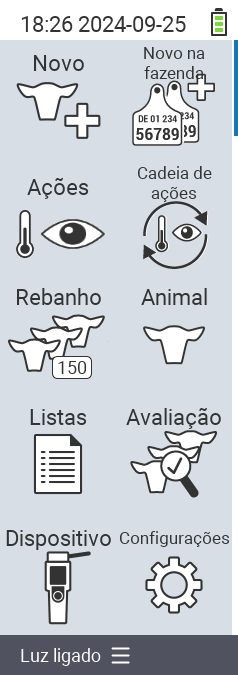

{}
Se você clicar em um item do menu, será redirecionado para uma descrição da respectiva função.
{}

<map name="workmap">
  <area shape="rect" coords="3,40,116,160" alt="Novo" title="Criar novos animais&#10;Clique do mouse: abrir documentação" href="/pt/docs/new/">
  <area shape="rect" coords="3,160,116,280" alt="Ações" title="Ações em animais&#10;Clique do mouse: abrir documentação" href="/pt/docs/actions/">
  <area shape="rect" coords="3,280,116,400" alt="Rebanho" title="Menu do rebanho&#10;Clique do mouse: abrir documentação" href="/pt/docs/herd/">
  <area shape="rect" coords="3,400,116,520" alt="Listas" title="Listas de animais&#10;Clique do mouse: abrir documentação" href="/pt/docs/lists/">
  <area shape="rect" coords="3,520,116,634" alt="Dispositivo" title="Dispositivo&#10;Clique do mouse: abrir documentação" href="/pt/docs/device/">

  <area shape="rect" coords="116,40,230,160" alt="Novo na fazenda" title="Acesso de animais&#10;Clique do mouse: abrir documentação" href="/pt/docs/new-on-farm/">
  <area shape="rect" coords="116,160,230,280" alt="Cadeia de ações" title="Cadeia de ações&#10;Clique do mouse: abrir documentação" href="/pt/docs/chain-of-actions/">
  <area shape="rect" coords="116,280,230,400" alt="Animal" title="Animal&#10;Clique do mouse: abrir documentação" href="/pt/docs/animal/">
  <area shape="rect" coords="116,400,230,520" alt="Avaliação" title="Avaliação&#10;Clique do mouse: abrir documentação" href="/pt/docs/evaluation/">
  <area shape="rect" coords="116,520,230,634" alt="Configurações" title="Configurações&#10;Clique do mouse: abrir documentação" href="/pt/docs/settings/">
</map>
