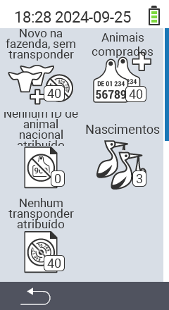

{}
Se você clicar em um item do menu, será redirecionado para uma descrição da respectiva função.
{}

<map name="workmap">
  <area shape="rect" coords="3,40,116,160" alt="Novo na fazenda, sem transponder" title="Aqui você atribui um transponder a novos animais sem transponder&#10;Clique do mouse: abrir documentação" href="/pt/docs/new-on-farm/new-no-transponder/">
  <area shape="rect" coords="3,160,116,280" alt="Sem ID nacional de animal atribuída" title="Aqui você pode ver todos os animais que ainda não foram atribuídos uma ID nacional de animal e atribuir uma ID nacional de animal&#10;Clique do mouse: abrir documentação" href="/pt/docs/new-on-farm/no-national-animal-id-assigned/">
  <area shape="rect" coords="3,280,116,399" alt="Sem transponder atribuído" title="Aqui você pode ver todos os animais que ainda não foram atribuídos um transponder e atribuir um transponder a eles&#10;Clique do mouse: abrir documentação" href="/pt/docs/new-on-farm/no-transponder-assigned/">

  <area shape="rect" coords="116,40,230,160" alt="Animais comprados" title="Aqui você pode ver suas compras atuais e exportar os dados&#10;Clique do mouse: abrir documentação" href="/pt/docs/new-on-farm/purchased-animals/">
  <area shape="rect" coords="116,160,230,280" alt="Nascimentos" title="Aqui você pode ver seus nascimentos e criar um arquivo de exportação&#10;Clique do mouse: abrir documentação" href="/pt/docs/new-on-farm/births/">
  <area shape="rect" coords="1,401,100,439" alt="Voltar" title="Voltar um nível&#10;Clique do mouse: para a documentação" href="/pt/docs/menu/mainmenu/">
</map>
