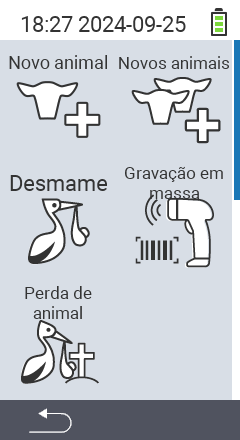

Via o item do menu principal  `` você acessa um submenu, onde 5 subitens são apresentados para seleção:

<map name="workmap">
  <area shape="rect" coords="3,40,116,160" alt="Novo animal" title="Como registrar um novo animal usando o dispositivo VitalControl&#10;Clique do mouse: abrir documentação" href="/pt/docs/new/animal/">
  <area shape="rect" coords="3,160,116,280" alt="Parto" title="Como registrar um novo parto usando o dispositivo VitalControl&#10;Clique do mouse: abrir documentação" href="/pt/docs/new/calving/">
  <area shape="rect" coords="3,280,116,399" alt="Perda de animal" title="Como registrar a perda de um animal usando o dispositivo VitalControl&#10;Clique do mouse: abrir documentação" href="/pt/docs/new/animal-loss/">

  <area shape="rect" coords="116,40,230,160" alt="Novos animais" title="Como criar vários novos animais no dispositivo VitalControl usando uma única ação&#10;Clique do mouse: abrir documentação" href="/pt/docs/new/animals/">
  <area shape="rect" coords="116,160,230,280" alt="Registro em massa" title="Use o leitor de código de barras para registrar uma variedade de animais&#10;Clique do mouse: abrir documentação" href="/pt/docs/new/bulk-recording/">

  <area shape="rect" coords="1,401,100,439" alt="Voltar" title="Voltar um nível&#10;Clique do mouse: para a documentação" href="/pt/docs/menu/mainmenu/">
</map>

{}
Cada submenu possui seu próprio ícone. Mova o ponteiro do mouse sobre um ícone na imagem acima e deixe-o descansar por um momento. Um tooltip aparecerá, mostrando informações sobre o submenu selecionado. Se você clicar em um dos ícones, será redirecionado para uma descrição do item de submenu selecionado.
{}

