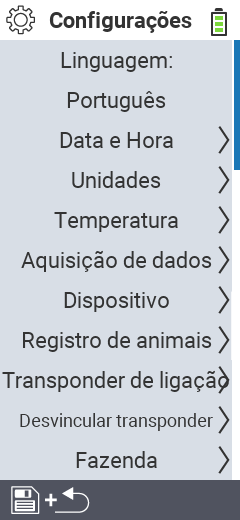

{}
Se você clicar em um item do menu, será redirecionado para uma descrição da respectiva função.
{}

<map name="workmap">
  <area shape="rect" coords="2,40,230,120" alt="Idioma" title="Defina e armazene permanentemente o idioma da interface do usuário no seu dispositivo VitalControl&#10;Clique do mouse: abrir documentação" href="/pt/docs/settings/language/">
  <area shape="rect" coords="2,120,230,160" alt="Data e Hora" title="Aqui, você define a data e a hora&#10;Clique do mouse: abrir documentação" href="/pt/docs/settings/datetime/">
  <area shape="rect" coords="2,160,230,200" alt="Unidades" title="Aqui você seleciona unidades para temperatura e massa&#10;Clique do mouse: abrir documentação" href="/pt/docs/settings/units/">
  <area shape="rect" coords="2,200,230,240" alt="Temperatura" title="Defina as configurações de temperatura para a aplicação do seu dispositivo VitalControl&#10;Clique do mouse: abrir documentação" href="/pt/docs/settings/temperature/">
   <area shape="rect" coords="2,240,230,280" alt="Aquisição de dados" title="Aqui você armazena informações relevantes para a coleta de dados dos animais&#10;Clique do mouse: abrir documentação" href="/pt/docs/settings/data-acquisition/">
   <area shape="rect" coords="2,280,230,320" alt="Dispositivo" title="Aqui você pode ajustar várias configurações do dispositivo&#10;Mausklick: zur Dokumentation" href="/pt/docs/settings/device/">
   <area shape="rect" coords="2,320,230,360" alt="Registro de animais" title="Aqui você pode ajustar vários padrões de fábrica relacionados ao registro de novos animais para os requisitos da sua fazenda.&#10;Clique do mouse: abrir documentação" href="/pt/docs/settings/animal-registration/">
   <area shape="rect" coords="2,360,230,400" alt="Vincular transponder" title="Defina a atribuição do transponder no seu dispositivo VitalControl&#10;Clique do mouse: abrir documentação" href="/pt/docs/settings/transponder-linkage/">
   <area shape="rect" coords="2,400,230,439" alt="Desvincular transponder" title="Especifique como o ID do animal será atribuído após o transponder ser desanexado&#10;Clique do mouse: abrir documentação" href="/pt/docs/settings/transponder-linkage/">
   <area shape="rect" coords="2,440,230,480" alt="Fazenda" title="Salve permanentemente seu ID nacional oficial de doze dígitos da fazenda no dispositivo VitalControl&#10;Clique do mouse: abrir documentação" href="/pt/docs/settings/farm-number/">
   <area shape="rect" coords="2,482,123,519" alt="Voltar" title="Voltar um nível" href="/pt/docs/menu/mainmenu/">
</map>

