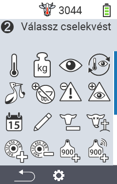
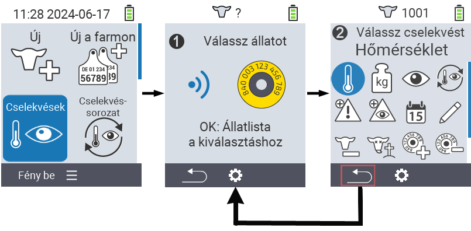
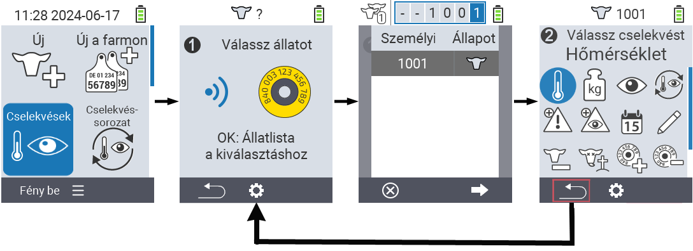

## Acțiuni disponibile {#available-actions}

În funcție de tipul de animal, puteți efectua până la 16 acțiuni diferite pentru un animal.

<map name="workmap">
  <area shape="rect" coords="3,100,60,165" alt="Temperatură" title="Măsurați febra la animalele dvs.&#10;Click mouse: deschideți documentația" href="/en/docs/actions/measure-temperature/">
  <area shape="rect" coords="60,100,118,165" alt="Cântărire" title="Înregistrați greutatea animalelor dvs.&#10;Click mouse: deschideți documentația" href="/en/docs/actions/record-weight/">
  <area shape="rect" coords="118,100,174,165" alt="Evaluare" title="Evaluați animalele dvs.&#10;Click mouse: deschideți documentația" href="/en/docs/actions/rating/">
  <area shape="rect" coords="174,100,230,165" alt="Lanț de acțiuni" title="Aplicarea și setarea lanțului de acțiuni&#10;Click mouse: deschideți documentația" href="/en/docs/chain-of-actions/">
   <area shape="rect" coords="3,165,60,225" alt="Fătare" title="Înregistrați o fătare&#10;Click mouse: deschideți documentația" href="/en/docs/actions/calving/">
   <area shape="rect" coords="60,165,120,225" alt="Încetare lactație" title="Încetați lactația unei vaci sau adăugați-o pe lista vacilor proaspete&#10;Click mouse: deschideți documentația" href="/en/docs/actions/dry-off/">
   <area shape="rect" coords="120,165,175,225" alt="Alarmă" title="Adăugați și eliminați animale din lista de alarme&#10;Click mouse: deschideți documentația" href="/en/docs/actions/alarm/">
   <area shape="rect" coords="175,165,230,225" alt="Supraveghere" title="Puneți animalele pe lista de supraveghere sau eliminați-le&#10;Click mouse: deschideți documentația" href="/en/docs/actions/on-watch/">
   <area shape="rect" coords="3,225,60,280" alt="Istoric animal" title="Vizualizați istoricul unui animal&#10;Click mouse: deschideți documentația" href="/en/docs/actions/animal-history/">
   <area shape="rect" coords="60,225,120,280" alt="Editare" title="Editați datele animalului selectat&#10;Click mouse: deschideți documentația" href="/en/docs/actions/edit/">
   <area shape="rect" coords="120,225,175,280" alt="Dezregistrare" title="Dezregistrați un animal&#10;Click mouse: deschideți documentația" href="/en/docs/actions/unregister/">
   <area shape="rect" coords="175,225,230,280" alt="Pierdere animal" title="Înregistrați pierderea unui animal&#10;Click mouse: deschideți documentația" href="/en/docs/actions/animal-loss/">
   <area shape="rect" coords="3,280,60,337" alt="Asociere transponder" title="Asociați un transponder unui animal&#10;Click mouse: deschideți documentația" href="/en/docs/actions/link-transponder/">
   <area shape="rect" coords="55,280,120,337" alt="Dezlegare transponder" title="Eliminați legătura transponderului cu un animal&#10;Click mouse: deschideți documentația" href="/en/docs/actions/unlink-transponder/">
   <area shape="rect" coords="120,280,175,337" alt="Asociere manuală ID animal" title="Asociați un ID național unui animal care nu are un ID național&#10;Click mouse: deschideți documentația" href="/en/docs/actions/link-animal-id/#link-animal-id">
   <area shape="rect" coords="175,280,230,337" alt="Asociere ID animal cu scanare" title="Asociați un ID național unui animal care nu are un ID național&#10;Click mouse: deschideți documentația" href="/en/docs/actions/link-animal-id/#link-animal-id-with-electronic-ear-tag-scan">

   <area shape="rect" coords="100,340,140,375" alt="Setări" title="Accesați setările&#10;Click mouse: către documentație" href="/en/docs/actions/setting/">
</map>

{}
Fiecare acțiune este identificată printr-un simbol. Mutați cursorul mouse-ului peste un simbol în graficul de mai jos și lăsați-l să stea pentru un moment. Va apărea un tooltip, prezentând informații despre acțiunea respectivă. Dacă faceți clic pe unul dintre simboluri, veți fi redirecționat către o descriere a acțiunii respective.
{}

## Procedură generală {#general-procedure}

În cadrul meniului   `` puteți selecta următorul animal în orice moment fără a părăsi elementul de meniu Acțiuni. Pentru a selecta următorul animal, procedați după cum urmează:

1. Selectați elementul de meniu   `` pe ecranul principal al dispozitivului dvs. VitalControl și apăsați butonul ``.

2. Fie scanați un animal folosind transponderul, fie selectați un animal din listă. Confirmați apăsând `` și selectați un animal folosind butoanele săgeată △ ▽. Confirmați cu ``.

3. Se deschide un submeniu în care veți găsi pictograme pentru numeroase acțiuni pentru animale. Utilizați butoanele săgeată pentru a selecta acțiunea dorită și începeți acțiunea apăsând butonul ``. În funcție de acțiunea selectată, vor apărea unul sau mai multe ecrane sau o fereastră pop-up.

4. Dacă doriți, puteți acum selecta și executa o altă acțiune pentru animalul curent.

5. După ce ați efectuat acțiunea(ele) dorită(e) pentru animal, reveniți la pasul 2 'Selecția animalului'. Pentru a face acest lucru, apăsați butonul din stânga `F1` de sub simbolul `` din colțul din stânga jos al subsolului.

6. Fereastra din pasul doi se va deschide din nou automat și puteți selecta următorul animal sau reveni la meniul principal apăsând butonul `F1` de sub simbolul ``.



{}

{}
{}

{}


